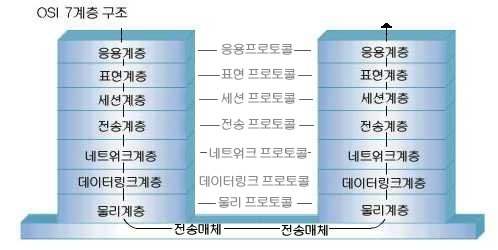
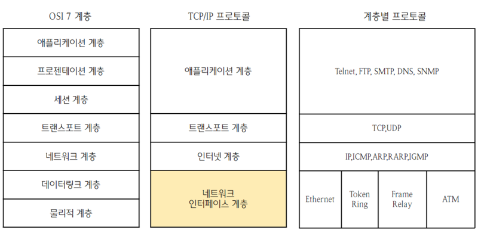
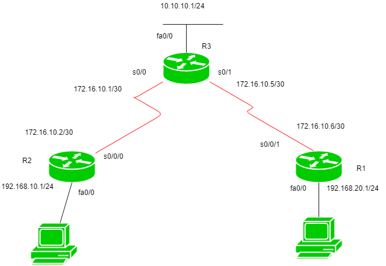
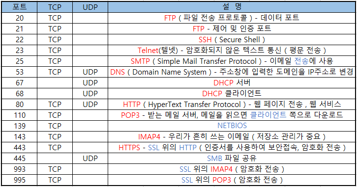
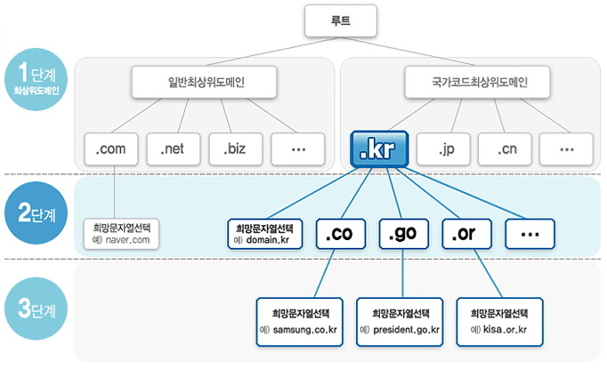

# Chapter 1
### 인프라 기술의 기초

 

# 네트워크와 프로토콜
### `네트워크`
* #### 현대 인프라의 필수요소
* #### 스위치, 라우터, 방화벽, VPN 장비. 로드밸런서 등의 장비로 구성

 

## OSI 참조 모델과 TCP/IP 계층 모델
### [OSI 참조 모델](https://github.com/LSH-3016/TIL/blob/main/CS/Network/OSI-7layerd.md)
#### 서로 다른 하드웨어가 섞여 있는 네트워크가 통신하는 규칙

* #### 각 계층에 부여된 역할을 서로 연계해서 통신
* #### 각 계층은 독립적이며, 어떤 계층에 변경이 발생해도 다른 계층에 영향을 주지 않음

 

### `TCP/IP 계층 모델` 
#### TCP/IP 프로토콜을 OSI 7계층 형식에 맞추어 추상화 시킨 모델

* #### 계층 구조 각각의 계층을 레이어라고 표현
* #### 레이어를 'L'이라고 표현함
  * #### `L3 스위치` : 네트워크 계층에서 통신을 제어하는 네트워크 장비
  * #### [L7 로드밸런서](https://github.com/LSH-3016/TIL/blob/main/CS/Network/Load_Balancing.md) : 애플리케이션 계층에서 동작하는 로드밸런서

 

# 프토토콜의 역할
### `IP 프로토콜`
* #### 인터넷에서의 기본중의 기본
* #### 2가지 기능을 함
  * #### 데이터에 IP 주소 정보를 추가
  * #### IP 주소를 기반으로 데이터를 전송할 때 경유하는 경로를 제어

 

## IP 주소와 넷마스크
### [IP 주소](https://github.com/LSH-3016/TIL/blob/main/CS/Network/IPv4_VS_IPv6.md)
* #### IP 프로토콜 기반의 네트워크에서 '서버 장비' 또는 '네트워크 장비'를 식별하는 주소
* #### 호스트마다 하나씩 있으며 유일해야 함
* #### 32비트로 구성된 비트 패턴 (10진수 표기)

 

### `특별한 IP 주소`
* #### `사설 주소` : 방화벽 안쪽 등 직접 인터넷에 연결되지 않은 네트워크
* #### `멀티캐스트 주소` : 데이터를 전송하고 싶은 호스트를 그룹화 하는데 사용되는 주소
* #### `루프백 주소` : 자기 자신을 지칭하는 주소 (127.0.0.1/localhost)

 

### [IPv4와 IPv6](https://github.com/LSH-3016/TIL/blob/main/CS/Network/IPv4_VS_IPv6.md)
### IPv4
* #### 32비트 주소 공간을 가지는 네트워크 주소
* #### 현재 IP 주소 고갈, 경로 제어 정보 증가, IP 헤더의 오버헤드 등의 문제점이 발생
### IPv6
* #### IPv4의 문제를 해결하기 위해 새로이 정의된 128비트 네트워크 주소

 

### `넷마스크`
* #### IP 주소 중 네트워크 부분과 호스트 부분을 구분하는 패턴
  * #### 네트워크 부분을 '1', 호스트 부분을 '0'으로 표현

 

### `라우팅`
#### 다른 네트워크와 통신하는 것
* #### `정적 라우팅` : 네트워크 내부의 말단에 가까운 네트워크나 큰 기업의 사내 네트워크 등을 정적인 규칙으로 라우팅 하는 것

* #### `동적 라우팅` : ISP 등이 관리하는 네트워크를 계산된 값에서 최소 거리를 찾아 라우팅 하는 방식
  * #### `OSPF` : 패킷 송신 대상을 동적으로 결정하는 라우팅 프로토콜의 일종
#### `라우팅 테이블`
* #### 라우터 또는 호스트 관련 정보가 저장되어 있는 경로 제어 테이블
* #### 네트워크 상에서 가장 빨리 도착할 수 있는 경로를 찾기 위해 참조하는 테이블

 

## [포트와 프로토콜](https://github.com/LSH-3016/TIL/blob/main/CS/Network/IP_TCP_UDP_HTTP.md)
### `포트 번호`
#### 컴퓨터에서 통신에 사용하는 프로그램을 식별하는 번호
### `Well Known Port`

### [TCP vs UDP](https://github.com/LSH-3016/TIL/blob/main/CS/Network/IP_TCP_UDP_HTTP.md)
|TCP|UDP|
|:---:|:---:|
|통신 신뢰성이 높음|통신 신뢰성이 낮음|
|연결형 프로토콜|비연결형 프로토콜|
|창 제어, 재전송 제어, 혼잡 제어 등을 수행|처리가 가볍고 지연이 적음|

 

## [도메인 이름과 DNS](https://github.com/LSH-3016/TIL/blob/main/CS/Network/DNS.md)
### `DNS`
#### 호스트 이름을 IP 주소로 변환하는 서비스
### `도메인 이름`

