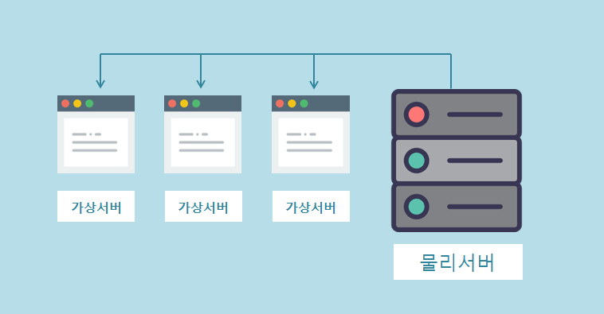
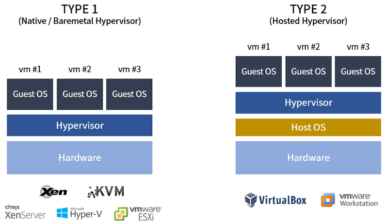
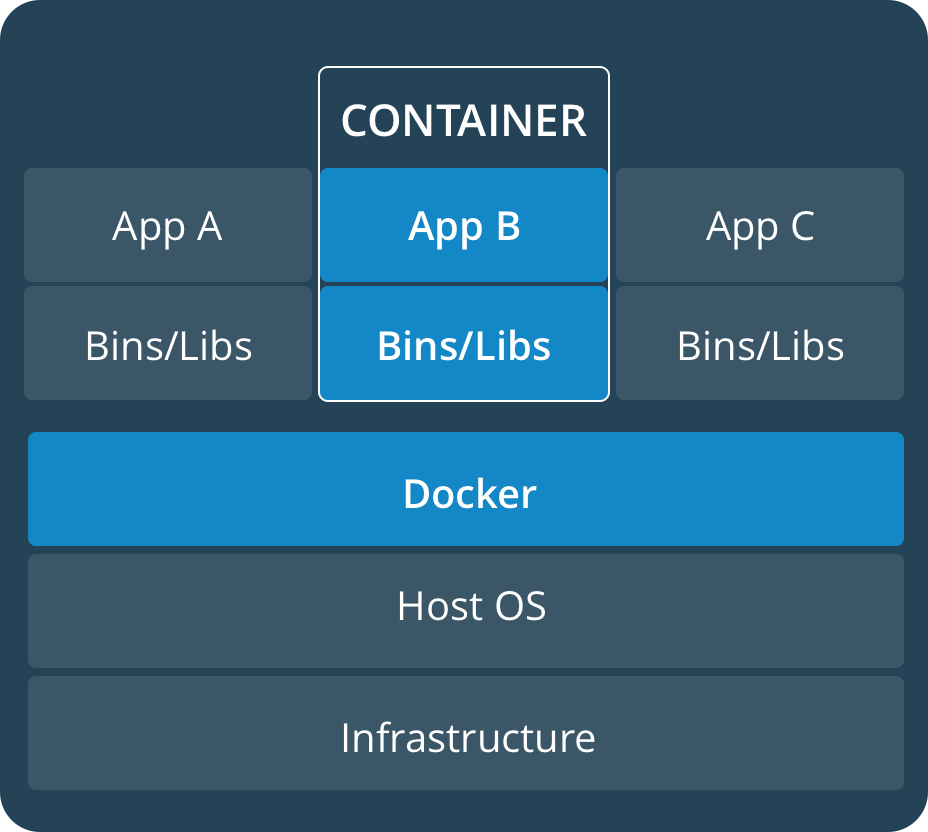

## Chapter 2
### 인프라의 변천과 특징

 

# 온프레미스로 시스템 구축
### `온프레미스(On Premise)` : 하드웨어를 직접 준비하고 운용하는 형태
* ### 장비 선택
    #### 원하는 장비를 선택하여 서버 운용에 사용
* ### 온프레미스 운용에 필요한 것
  * #### 서버의 부하도를 측정할 수 있는 장비로 필요한 서버의 성능과 수를 산출
  * #### 서버를 스스로 설치하고, 네트워크 장비도 모두 설정해야 함 (서버와 네트워크 등의 전문지식이 필요)
  * #### 서버를 냉각(열 배출)시킬 수 있는 에어컨과 같은 장비가 필요
  * #### 정전이 발생해도 서버를 지킬 수 있는 장치가 필요

 

# VPS를 사용한 시스템 만들기
### `VPS(Virtual Private Network)` : 물리 서버를 여러 대의 가상 서버로 분할하여 제공하는 서비스

## `가상화` : 물리 서버 1대에서 여러 대의 가상 서버를 동작시키는 기술
###### 가상화 기술로 만들어진 여러 대의 `가상 서버`를 가상머신 이라고 함
|도구|방식|개요|
|:---:|:---:|:---:|
|KVM(Kernel-based Virtual Machine)|완전가상화|리눅스(Linux) 커널에서 제공하는 Intel VT 또는 AMD-V를 사용한 가상화|
|Xen|완전 가상화, 반 가상화|IA-32, X64, IA-64, ARM 아키턱처에 대응하는 가상화 소프트웨어|
|OpenVZ|컨테이너 형태|RHEL 전용 서버 가상화 소프트웨어로,여러 개의 독립된 리눅스 인스턴스를 물리 서버 1대에서 만들 수 있게 함|
|LXC|컨테이너 형태|개별 프로세스와 네트워크 공간을 만드는 가상 환경|
* ### 사용자가 원하는 OS 선택하여 이용할 수 있음
* ### 여러 대의 서버로 구성 할 수 있음 (서버 추가 가능)
* ### 하드웨어는 VPS 제공자가 관리하지만 서버 관리는 사용자 몫

### KVM 방식 가상화

* #### VPS 가상화 방식으로 가장 많이 사용되는 것
* #### 리눅스 커널 자체를 `하이퍼바이저` 기반으로 동작 시키는 방식
  ###### `하이퍼바이저` : 가상화를 실현하는 제어 프로그램
* #### OS와 하드웨어를 모두 에뮬레이트함
  #### 호스트 OS와 CPU 아키텍처가 달라도 동작할 수 있게 함

### [컨테이너 기반 가상화](https://github.com/LSH-3016/TIL/blob/main/CS/Network/Docker.md)

* #### OS의 커널 부분을 컨테이너들끼리 공유해서 사용하는 방식
* #### 오버헤드가 적어 1대의 물리서버에서 많은 컨테이너를 제공
* #### 사용할 수 있는 OS가 한정적이라는 단점이 있음
* #### 호스트 OS의 커널을 사용하기 때문에 커널과 관련된 조작이 불가

# [클라우드 컴퓨팅](https://github.com/LSH-3016/TIL/blob/main/CS/Network/AWS.md)