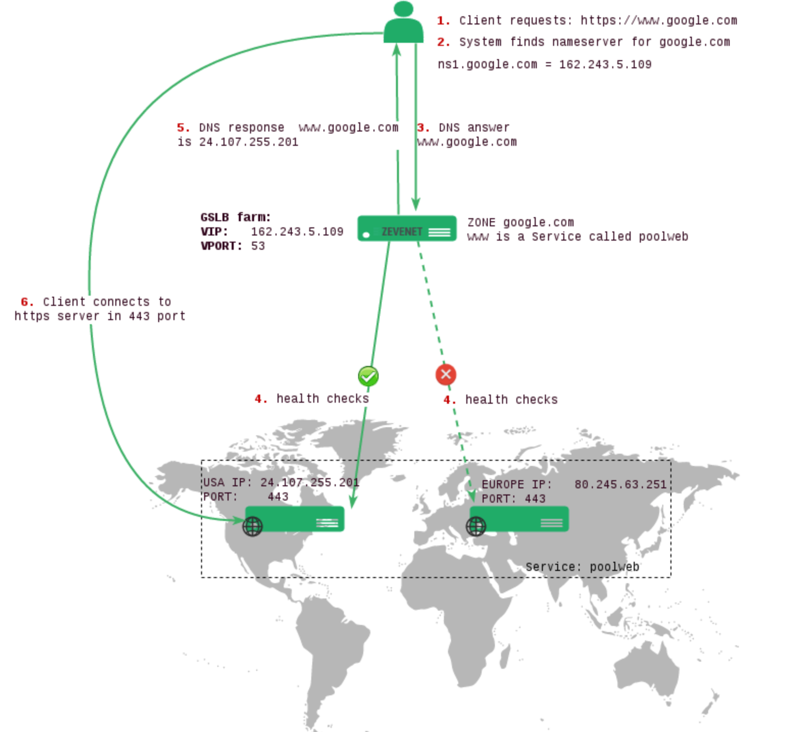
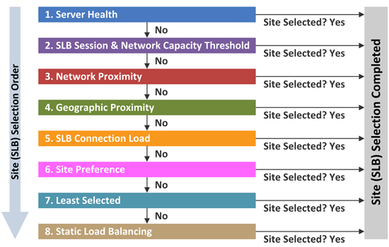
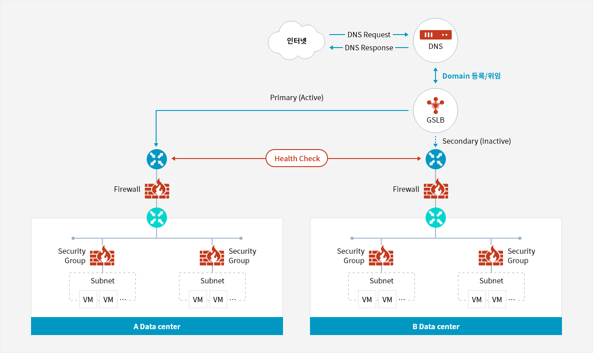

# GSLB(Global Server Load Balancing)
### ※ 특정 지역에 집중되는 트래픽을 분산하는 DNS 기반의 로드 밸런싱

## [DNS(Domain Name Service)](https://github.com/LSH-3016/TIL/blob/main/CS/Network/DNS.md)
### 도메인 네임을 IP 주소로 매핑해주는 서비스

## DDNS(Dynamic DNS)
* #### 실시간으로 DNS 갱신하며, 동적 DNS라고 불림
* #### IP주소가 변경되어도 DNS에서 자동으로 IP주소를 갱신해주어 IP가 변경되어도 정상이용 가능

## [LB(LoadBalancing)](https://github.com/LSH-3016/TIL/blob/main/CS/Network/Load_Balancing.md)
### 서버에 가해지는 부하를 분산해주는 장치 또는 기술

## ■ GSLB의 특징
* #### DNS의 로드밸런싱 문제를 해결하기 위해 등장
    #### → DNS는 IP 목록중 하나를 반환만 하는 단점이 존재
* #### GLSB는 네트워크 지연, 성능, 트래픽 유입, 서비스 실패등을 고려

## ■ GSLB의 주요 기능
* ### `HealthCheck`
  

  * #### 등록된 호스트들에 대해 주기적으로 요청을 보내고, 만약 실패시 DNS 응답에서 해당 서버를 제외
  * #### 실패한 서버에대한 사전 차단으로 장애 방지 및 서비스 실패 확률을 낮춤
* ### `네트워크 거리 & 지역`
  * #### 주기적으로 성능과 거리를 측정하여 가장 효율이 좋은 DNS 서버를 반환
* ### `GSLB Policy`
  

## ■ GSLB 구성도

참고자료
* [SAMSUNG SDS](https://www.samsungsds.com/kr/network-gslb/gslb.html)
* [네트워크 관리자 빵수의 이야기](https://skstp35.tistory.com/294)
* [코딩스타트](https://coding-start.tistory.com/339)