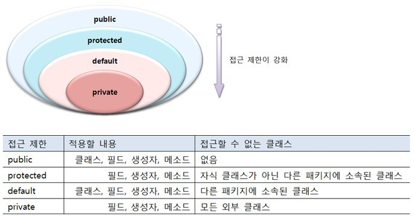

# 접근제한자(Access Modifier)란?
### ▶ 객체의 멤버들에게 `접근 제한`을 거는 것

## 종류
### public
#### ▶ package, Class가 동일하지 않아도 모든 접근이 가능한 제한자 
###### 모든 접근을 허용

### protected
#### ▶ 같은 package에서만 접근을 허용, 다른 package에서 접근시 해당 Class를 상속받아야 접근 가능한 제한자
###### 같은 패키지(폴더)에 있는 객체와 상속관계의 객체들만 허용

### default
#### ▶ 동일 package에서만 접근을 허용, 접근제한자 생략시 default 적용
###### default는 자동으로 선언되므로 변수, 메소드 앞에 명시적으로 적어서는 안됨
###### 같은 패키지(폴더)에 있는 객체들만 허용

### private
#### ▶ 동일 package, 다른 package 모두 접근 불가, 같은 class 내에서만 접근 허용하는 제한자
###### 현재 객체 내에서만 허용

## 접근 제한자 별 사용 가능 범위

### 클래스(Class)
#### ▶ `public, default`

### 생성자(Constructor)
#### ▶ `public, protected, default, private`

### 멤버변수(Member Variable)
#### ▶ `public, protected, default, private`

### 멤버메소드(Member Method)
#### ▶ `public, protected, default, private`

### 지역변수
#### ▶ `접근 제한자 사용 불가`

# 생성자(Constructor)란?
### ▶ `new 연산자`를 통해서 인스턴스를 생성할 때 반드시 호출이 되고 제일 먼저 실행되는 일종의 메소드
###### 인스턴스 변수(필드 값 등)를 초기화 시키는 역할

## 생성자 선언
<pre>
<code>클래스(매개변수선언, ... ) { // 생성자 블록
  // 객체의 초기화 코드
}
</code></pre>
* 메소드와 비슷한 모양을 가지지만, 반환 타입이 없고 클래스 이름과 동일
* 매개 변수선언 생략 또는 여러 개 선언 가능
* 매개 변수는 `new 연산자`로 생성자 호출 시 외부의 값을 생성자 블록 내부로 전달하는 역할을 함

## 필드 초기화
* 클래스로부터 객체가 생성될 때 기본 초기값으로 자동 설정
  * 임의의 값으로 초기화 방법
    * 플드를 선언할 때 초기값을 선언
       ###### 필드를 선언할때 초기값을 선언하면, 동일한 클래스로부터 생성되는 개체들은 모두 같은 값을 갖게 됨
    * 생성자에서 초기값을 선언 (매개변수)

## 생성자 오버로딩(Overlading)
▶ 매개변수를 달리하는 생성자를 여러 개 선언이 가능하도록 하는 것

#### ★ 생성자 오버로딩시 주의할 점
###### 매개 변수의 타입과 개수, 선언된 순서가 같을 경우 `매개 변수 이름만 바꾸는 것은 생성자 오버로딩으로 볼 수 없음`

# 객체지향 개발 5대 원리(SOLID)

## SRP(단일책임의 원칙, Single Responsibility Principle)
#### ▶ 작성된 클래스는 `하나의 기능`만 가지며 클래스가 제공하는 모든 서비스는 그 `하나의 책임`을 수행하는 데 집중되어 있어야 한다는 원칙
###### 어떤 변화에 의해 클래스를 변경해야 하는 이유는 `오직 하나`뿐이어야 함

 

## OCP(개방폐쇄의 원칙, Open Colse Principle)
#### ▶ 기존의 코드를 변경하지 않으면서 기능을 추가할 수 있도록 설계되어야 한다는 원칙
###### 요구사항의 변경이나 추가사항이 발생하더라도 기존 구성요소는 `수정이 일어나서는 안되며`, 기존 구성요소를 쉽게 확장해서 `재사용`할 수 있어야 함

 

## LSP(리스코프 치환의 원칙, The Liskov Substitution Principle)
#### ▶ 자식 클래스는 최소한 자신의 부모 클래스에서 가능한 행위를 수행할 수 있어야 한다는 원칙
###### 서브 타입은 언제나 기반 타입으로 교체할 수 있어야 한다 (부모 클래스와 자식 클래스의 행위는 일관 되어야 함)

 

## ISP(인터페이스 분리 원칙, Interface Segregation Principle)
#### ▶ 하나의 일반적인 인터페이스보다 여러 개의 구체적인 인터페이스가 낫다는 원칙
###### 클라이언트는 자신이 이용하지 않는 기능에는 영향을 받지 않아야 한다 (인터페이스를 클라이언트에 `특화되도록 분리`시키는 설계 원칙)

 

## DIP(의존 역전 원칙, Dependency Inversion Principle)
#### ▶ 프로그래머는 구체화가 아닌 추상화에 의존해야 한다는 원칙
###### 변화하기 쉬운 것 또는 자주 변화하는 것보다는 `변화하기 어려운 것`, `거의 변화가 없는 것`에 의존하라는 원칙

참고자료
* #### 접근제한자(AM)
    * [Minsub](https://gyrfalcon.tistory.com/entry/JAVA-%EC%A0%91%EA%B7%BC-%EC%A0%9C%ED%95%9C%EC%9E%90)
    * [gil.log](https://velog.io/@gillog/Java-%EC%A0%91%EA%B7%BC-%EC%A0%9C%ED%95%9C%EC%9E%90)

* #### 생성자(Constructor)
    * [Kehpi Javatory](https://kephilab.tistory.com/47)
    * [JOKER's ROOM](https://blog.naver.com/PostView.nhn?isHttpsRedirect=true&blogId=heartflow89&logNo=220955879645)

* #### 객체지향 개발 5대 원리(SOLID)
    * [자주와조요](https://velog.io/@kyle/%EA%B0%9D%EC%B2%B4%EC%A7%80%ED%96%A5-SOLID-%EC%9B%90%EC%B9%99-%EC%9D%B4%EB%9E%80)
    * [넥스트리](https://www.nextree.co.kr/p6960/)
    * [위키백과](https://ko.wikipedia.org/wiki/SOLID_(%EA%B0%9D%EC%B2%B4_%EC%A7%80%ED%96%A5_%EC%84%A4%EA%B3%84))