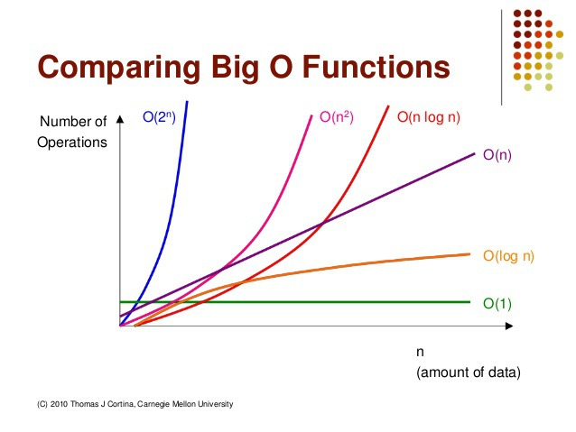

# 빅오 표기법(Big-O)
* #### 알고리즘의 시간복잡도(효율성)을 표기해주는 표기법
* #### 입력값이 무한대로 향할때 함수의 상한을 설명하는 수학적 표기 방법

## 세 가지 표기법 중 빅오를 사용하는 이유?
* #### 빅오 표기법이 알고리즘 효율성을 상한선 기준으로 표기하기 때문
* #### 빅오로 시간 복잡도를 표현할때는 최고차항만 표기

## 특징
* ### 상수항 무시 : 데이터 입력값(n)이 충분히 크다고 가정,
  ### 알고리즘의 효율성 또한 데이터 입력값(n)의 크기에 따라 영향 바딕 때문에 상수항 같은 사소한 부분 무시
* ### 영향력 없는 항 무시 : 데이터 입력값(n)의 크기에 따라 영향을 받기 때문에
  ### 가장 영향력이 큰 항 이외에 영향력 없는 항들은 무시

## 표기법 종류
* ### `O(1)` : 입력값에 상관없이 일정한 실행시간을 가즌 알고리즘
    ### 예) 스택의 Push, Pop
* ### `O(log n)` : 매우 큰 입력값에서도 크게 영향을 받지 않는 매우 견고한 알고리즘
    ### 예) 이진트리
* ### `O(n)`
    * ### 실행시간이 입력값에 비례하는 알고리즘
    * ### 정렬되지 않은 리스트에서 최대 또는 최솟값을 찾는 경우에 해당
    * ### 모든 입력값을 적어도 한 번 이상은 살펴봐야 하는 특징
    ### 예) for 문
* ### `O (n log n)`
    * ### 대부분의 효율 좋은 알고리즘의 실행시간
    * ### 아무리 좋은 알고리즘이라도 이 시간보다 빠를 수 없음
    * ### 입력값이 최선일 경우, 비교를 건너 뛰어 O(n)이 될 수 있음
    ### 예) 퀵 정렬(Quick Sort), 병합 정렬(Merge Sort), 힙 정렬(Heap Sort)
- ### `O(n^2)` : 비효율 적인 알고리즘이 대부분 이에 해당
    ### 예) 이중 for문, 삽입 정렬(Insertion Sort), 버블 정렬(Bubble Sort), 선택 정렬(Selection Sort)
- ### `O(2^n)`
    ### 예) 피보나치 수열

참고자료
* [인생의 로그켓](https://noahlogs.tistory.com/27)
* [muntari Log](https://codermun-log.tistory.com/235)