# 이진탐색 (Binary Search)
### ▶ 정렬되어 있는 배열에서 특정 값을 찾아내는 알고리즘
#### 리스트의 중간 값과 비교하여 검색값을 찾으며,
## ※ 반드시 정렬된 배열에서만 사용 가능

## 동작 방식
검색 값 = key, 배열의 중간 값 = mid
### 1. 배열의 mid를 가져옴
### 2. mid와 key를 비교
  * ### (mid = key) 종료
  * ### (mid < key) 중간 값 기준 배열의 오른쪽 탐색
  * ### (mid > key) 중간 값 기준 배열의 왼쪽 탐색
### 3. 위 과정을 key 값을 찾을 때까지 반복

## 동작 예시
### Key = 32라고 설정하고 찾는 과정

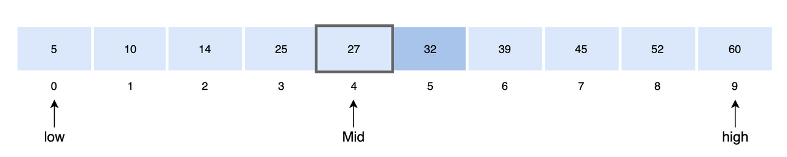
### 배열에서 Mid 값을 설정 `27`
 

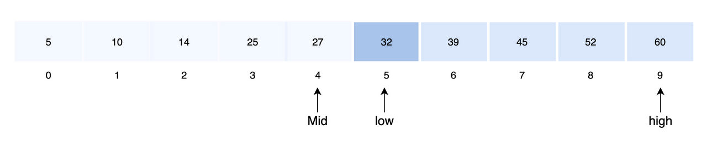
### `Mid < Key` 이므로 Mid 값 기준 배열의 오른쪽 탐색
 

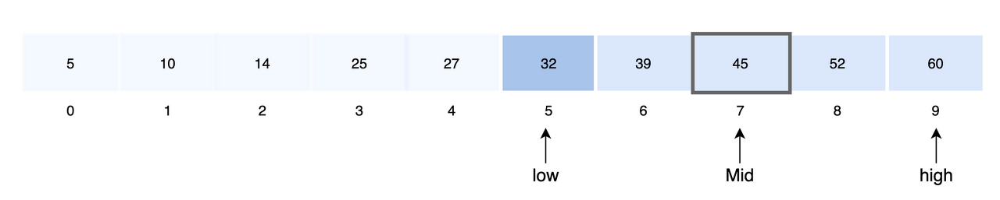
### 오른쪽 배열에서 Mid 값 재설정 `45`
 

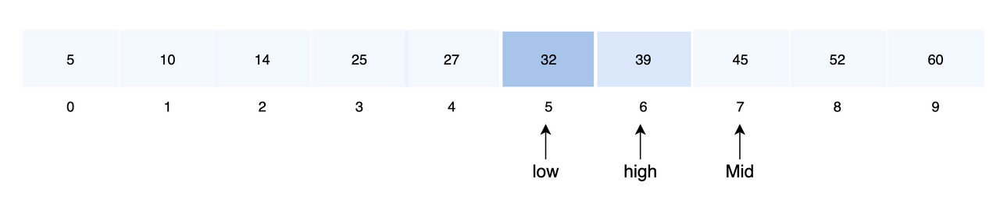
### `Mid > Key` 이므로 Mid 값 기준 배열의 왼쪽 탐색
 

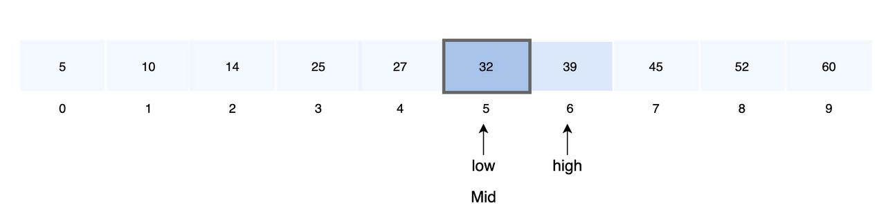
### 왼쪽 배열에서 Mid 값 재설정 `32`
### `Mid = Key`이므로 탐색 종료
 

## 시간복잡도
* ### `Best` : O(1)
* ### `Average`, `Worst` : O(logN) 

## 코드 예시
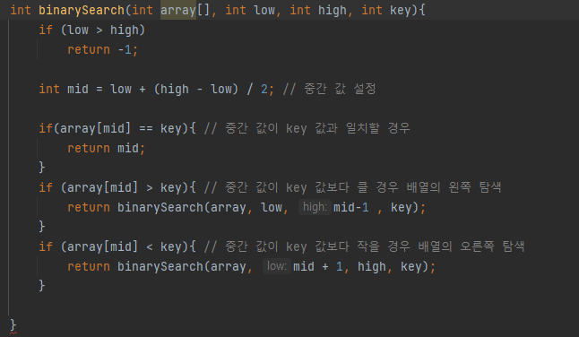

# 이진 탐색 트리(Binary Search Tree)
### ▶ 이진트리이면서 특정 속성을 갖는 트리

* ### 이진 탐색 트리의 노드에 저장된 키(Key)는 유일
* ### 부모의 키가 왼쪽 자식 노드의 키보다 큼
* ### 부모의 키가 오른쪽 자식 노드의 키보다 작음
* ### 왼쪽과 오른쪽 서브 트리도 이진 탐색 트리

## 탐색 과정
* ### 루트 노드의 키와 찾고자 하는 값을 비교
    * #### `찾고자 하는 값 = 루트 노드의 키` : 탐색 종료
    * #### `찾고자 하는 값 < 루트 노드의 키` : 왼쪽 서브 트리로 탐색
    * #### `찾고자 하는 값 > 루트 노드의 키` : 오른쪽 서브트리로 탐색
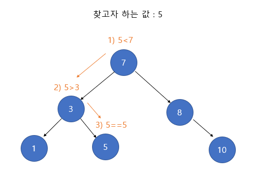

## 삽입
* ### 탐색과정과 비슷하며 루트 노드의 키와 삽입 하고자 하는 값을 비교
  * ### `삽입 값 = 루트 노드의 키` : 삽입 오류 (중복값을 허용하지 않음)
  * ### `삽입 값 < 루트 노드의 키` : 왼쪽 서브 트리를 탐색하여 비어있다면 삽입, 값이 존재하면 다시 비교
  * ### `삽입 값 > 루트 노드의 키` : 오른쪽 서브 트리를 탐색하여 비어있다면 삽입, 값이 존재하면 다시 비교
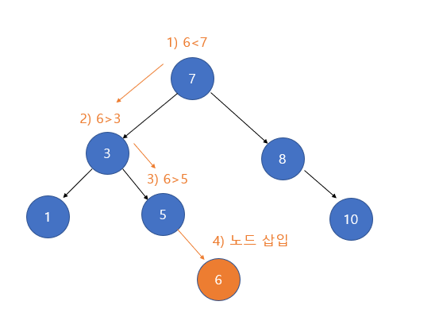

## 삭제
* ### `단말 노드` : 부모 노드의 자식 노드를 NULL로 만들고, 해당 노드를 삭제
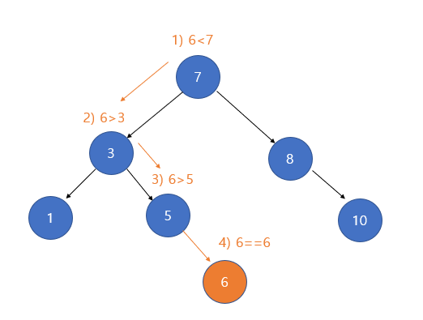
* ### `서브 트리가 하나 존재하는 경우` : 삭제할 노드의 자식 노드를 삭제 노드의 부모 노드의 자식 노드로 만들고 해당 노드를 삭제
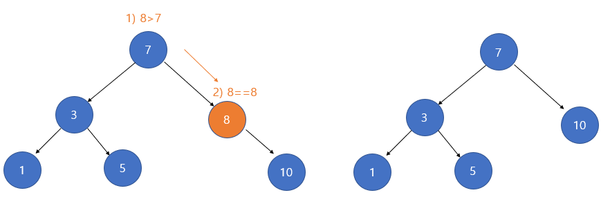
* ### `서브 트리가 두 개인 경우`
  * ### 삭제할 노드 왼쪽 서브 트리의 가장 큰 자식 노드를 해당 삭제 노드 자리에 올림
  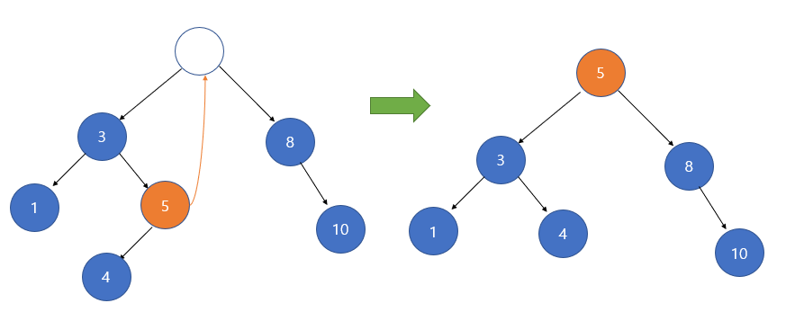
  * ### 삭제할 노드 오른쪽 서브 트리의 가장 작은 자식 노드를 해당 삭제 노드 자리에 올림
  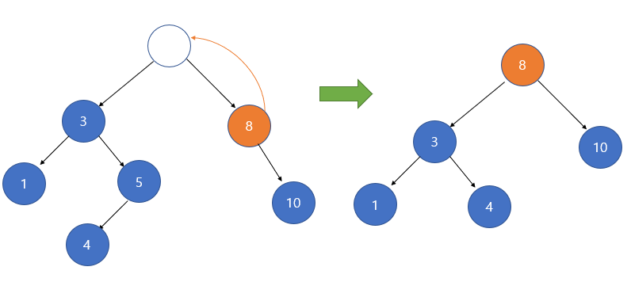

 

## 한계점
### 키 값들의 균형이 맞지 않을 경우 일렬로 늘어뜨려져 높이가 증가해 계산복잡성이 비효율적으로 늘어남

참고자료
* [yoongrammer](https://yoongrammer.tistory.com/75)
* [코드 연구소](https://code-lab1.tistory.com/10)