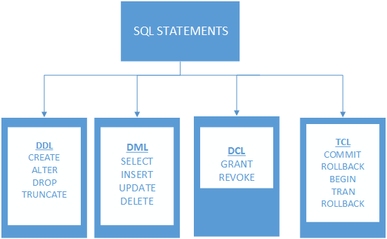

# SQL (Structured Query Language)
#### ▶ 관계형 데이터베이스 시스템(RDBMS)에서 자료를 관리 및 처리하기 위해 설계된 언어

## DDL (Data Definition Language, 데이터 정의서)
#### 데이터베이스를 정의하는 언어이며,
#### 데이터리를 생성, 수정, 삭제하는 등의 데이터의 전체의 골격을 결정하는 역할을 하는 언어
###### ※ 데이터베이스 테이블에 영향을 미치기 때문에 작업이 즉시 완료(Auto Commit)됨

## DML (Data Manipulation Language, 데이터 조작어)
#### 정의된 데이터베이스에 입력된 레코드를 조회·수정·삭제 등의 역할을 하는 언어
###### ※ 자동으로 커밋되지 않아 영구적이지 않으며, 롤백할 수 있음

## DCL (Data Control Language, 데이터 제어 언어)
#### 데이터베이스에 접근하거나 객체에 권하을 주는 등의 역할을 하는 언어
###### ※ 데이터베이스 테이블에 영향을 미치기 때문에 즉시 완료(Auto Commit)

## TCL (Transaction Control Language, Transaction 제어 언어)
#### 데이터의 보안, 무결성, 회복, 병행 수행제어 등을 정의하는데 사용
* ### COMMIT
    #### 트랜잭션의 작업 결과를 저장 반영 (트랜잭션 완료)
* ### ROLLBACK
    #### 데이터베이스를 마지막 COMMIT 된 시점의 상태로 복원
* ### SAVEPOINT
    #### 롤백을 할 시점을 정의

참고자료
* [자유인을 위하여](https://iamfreeman.tistory.com/entry/DBMS-%EB%8D%B0%EC%9D%B4%ED%84%B0-%EC%96%B8%EC%96%B4-DDL-DML-DCL-TCL-%EC%9D%98-%EC%A0%95%EC%9D%98)
* [ai_researcher.log](https://velog.io/@cha-suyeon/%EB%8D%B0%EC%9D%B4%ED%84%B0%EB%B2%A0%EC%9D%B4%EC%8A%A43-SQL-DDL-DML-DCL)