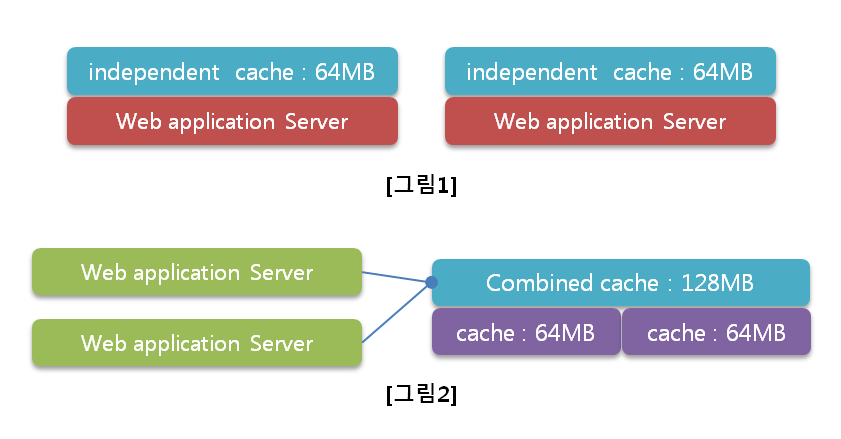

# Memcached
#### ▶ 무로료 사용할 수 있는 오픈 소스이며, 분산메모리 캐싱 시스템
* DB의 부하를 줄여 웹 애플리케이션의 속도 개선을 위해 사용

### 장점
* #### 별도의 캐시 서버를 로직 상 하나의 서버로 보고 사용할 수 있도록 함
* #### 서버가 몇 대든 상관없이 한 개의 객체만을 활용하여 저장 및 조회할 수 있으므로 능륙적이고 대용량의 캐시 시스템을 갖춤

### 단점
* #### 인 메모리 기반의 시스템으로 재부팅 시 데이터가 소멸하고, 영구적인 저장용 시스템으로 활용할 수 없음

# Redis
#### ▶ Key, Value 구조의 비정형 데이터를 저장하고 관리하기 위한 오픈 소스 기반의 비관계형 DBMS

#### DB, Cache, Message Queue, Shared Memory 용도로 사용 (주로 Cache 서버를 구현할 때)
## 특징
* ### 모든 데이터를 메모리에 저장하고 조회하는 인메모리 데이터베이스
    #### 데이터를 디스크가 아닌 메모리에서 처리하기 떄문에 속도가 매우 빠름
* ### 다양한 자료구조를 지원
    #### 개발의 편의성이 좋아지고 난이도가 낮아짐
    
    #### 다양한 데이터 구조체를 지원하고, 이를 컬렉션이라고 부름
* ### 싱글 쓰레드
    #### 연산을 원자적으로 수행 (명려어를 순차적으로 처리하며, 처리 시간이 길어질 경우 대기현상이 발생)
* ### 읽기 성능 증대를 위한 서버 측 리플리케이션을 지원
    #### `리플리케이션` : 데이터 저장과 관련 있는 데이터를 복사해두어 DBMS의 부하를 낮추어 줄 용도로 사용하는 것
* ### 쓰기 성능 증대를 위한 클라이언트 측 샤딩 지원
    #### `샤딩` : 샤드라는 작은 테이블로 데이터베이스 테이블을 수평분할하여 분산 저장·관리하는 기술

## Redis의 영속성 보장
#### `영속성` : 프로그램이 종료되어도 데이터가 사라지지 않는 특성
### 데이터를 디스크에 저장하고, 서버가 내려가도 디스크에 저장된 데이터를 읽어서 메모리에 로딩

* ### RDB(Sanpshotting) 방식
    #### 특정 순간의 메모리 내용 전체를 디스크에 옮겨 담는 방식
* ### AOF(Append On FIle) 방식
    #### Redis의 모든 write/update 연산 자체를 모두 Log 파일에 기록하는 형태

## 주의점
* ### 서버 장애가 발생했을 경우에 대한 운영 플랜이 필요
    #### 인메모리 특성상 서버 장애가 발생할 경우 데이터 유실이 발생할 수 있음
* ### 메모리 관리가 중요
* ### 싱글 스레드
    ####  한 번에 하나의 명령만 처리 가능 → 많은 처리 시간이 소요되는 요청 명령은 피해야함