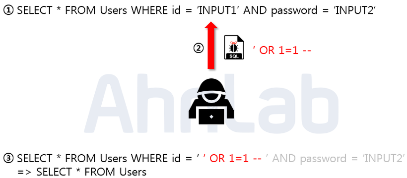

# SQL Injection
* #### 악의적인 사용자가 보안상의 취약점을 이용하여, 임의의 SQL문을 주입하고 실행되게 하여, 데이터베이스가 비정상적인 동작을 하도록 조작하는 행위
* #### 대부분 클라이언트가 입력한 데이터를 제대로 필터링 하지 못하는 경우에 발생
* #### OWASP TOP 10 중 첫 번째에 속해 있으며, 공격이 비교적 쉬운 편이고, 공격에 성공할 경우 큰 피해를 입힐 수 있음
    #### `OWASP` : 오픈소스 웹 애플리케이션 보안 프로젝트, 10대 웹 애플리케이션 취약점

 

## 공격 종류
* ## Error based SQL Injection
    * #### 논리적 에러를 이용한 방법
    * #### 에러가 발생되는 사이트에서는 에러 정보들을 이용하여 DB 및 쿼리 구조 등의 정보를 추측 가능
    * #### 공격 대상 : `SELECT * FROM Users WHERE id = 'INPUT1' AND password = 'INPUT2'`
    * #### 공격 SQL : `SELECT * FROM Users WHERE id = '' OR 1=1 -- ' AND password = 'INPUT2'`
    
    * #### Users 테이블의 모든 정보를 조회하여 관리자 계정으로 로그인 (관리자 계정 탈취)
* ##  Union based SQL Injection
  * #### Union 명령어를 이용한 SQL Injection
  * #### 정상적인 쿼리문에 하나의 추가 쿼리를 삽입하여 정보 탈취
  * #### 두 테이블의 `컴럼 수`와 `데이터형`이 같아야하는 조건이 있음
  * #### 공격 대상 : `SELECT * FROM Board WHERE title LIKE '%INPUT%' OR contents '%INPUT%'`
  * #### 공격 SQL : `SELECT * FROM Board WHERE title LIKE '% ' UNION SELECT null,id,passwd FROM Users -- INPUT%' OR contents '%INPUT%'`
  
* ## Blind SQL Injection
  * ### Boolean based SQL
  * #### 참과 거짓의 정보만으로 정보 탈취
  * #### 서버가 응답하는 성공과 실패 여부를 이용하여 DB의 테이블 정보 등을 추출
  * #### 공격 대상 : `SELECT * FROM Users WHERE id = 'INPUT1' AND password = 'INPUT2'`
  * #### 공격 SQL : `SELECT * FROM Users WHERE id = 'abc123' and ASCII(SUBSTR((SELECT name FROM information_schema.tables WHERE table_type='base table' limit 0,1),1,1)) > 100 (로그인이 될 때까지 시도) -- INPUT1' AND password = 'INPUT2'`
  
  * ### Time based SQL
  * #### 쿼리 결과를 특정 시간만큼 지연
  * #### DB 구조 파악 (시간을 측정하여 파악)
  * #### 공격 대상 : `SELECT * FROM Users WHERE id = 'INPUT1' AND password = 'INPUT2'`
  * #### 공격 SQL : `SELECT * FROM Users WHERE id = 'abc123' OR (LENGTH(DATABASE())=1 (SLEEP 할 때까지 시도) AND SLEEP(2)) -- INPUT1' AND password = 'INPUT2'`
  
* ## Stored Procedure SQL Injection
  * #### `Stroed Procedure` : 편의를 위해 일련의 쿼리들을 모아 하나의 함수처럼 모아둔 것
  * #### MS SQL에서 사용할 수 있는 `xp_cmdshell`을 통해 윈도우 명령어 실행
  * #### 공격자가 시스템 권한을 획득해야 하므로 공격난이도가 높음
* ## Mass SQL Injection
  * #### 한 번의 공격으로 다량의 DB가 조작되어 큰 피해를 입히는 것
  * #### MS-SQL을 사용하는 ASP 기반 웹 애플리케이션에서 많이 사용
  * #### DB 값을 변조하여 DB에 악성 스크립트를 삽입하고, 사용자들이 변조된 사이트에 접속하도록 하여 좀비 PC로 감염되게 함

## 대응 방안
* ## 입력 값에 대한 검증
  * #### 사용자의 입력이 DB Query에 동적으로 영향을 줄 경우, 입력된 값이 개발자가 의도한 값인지 검증
* ## Prepared Statement 구문 사용
  * #### 미리 컴파일 하지 않고 대기 시켜, 문자열 인식 공격을 막음
* ## Error Massege 노출 금지
  * #### 테이블명이나 컬럼, 쿼리문 등이 노출 되지 않도록 오류 페이지나 메시지 박스를 따로 제작
* ## 웹 방화벽 사용
  * #### 최소 권한 유저로 DB 운영
  * #### 사용하지 않는 저장 프로시저와 내장함수 제거 또는 권한제어
  * #### 목적에 따라 Query 권한 수정
  * #### 공용 시스템 객체의 접근 제어
  * #### 신뢰할 수 있는 네트워크, 서버에 대해서만 접근 허용
  

참고자료
* [염초코](https://choco4study.tistory.com/10)
* [NoirStar Space](https://noirstar.tistory.com/264)