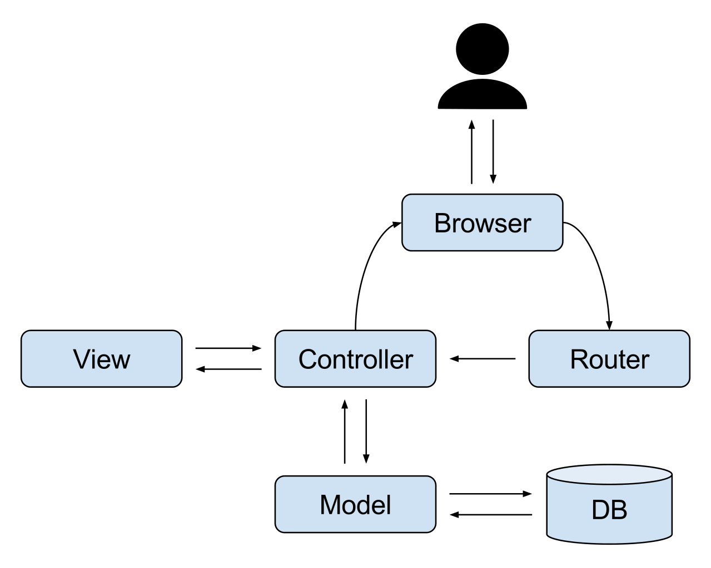

# DTO(Data Transfer Object)
#### ▶ 계층간 데이터 교환을 위해 사용하는 객체(Bean)
###### `BEAN` : Spring에서 사용하는 객체

## MVC 패턴
#### ▶ 구성요소를 Model, View, Controller 세 가지 역할로 구분하는 디자인 패턴

 * #### Model과 View는 서로의 존재를 인지하지 못하며, Controller가 Model과 View를 연결함
 * #### Controller는 View로부터 들어온 사용자 요청을 해석하여 Model을 업데이트하거나 데이터를 받아 View로 전송
 * #### Model과 View를 분리함으로써 의존성을 낮추고 독립적인 개발이 가능
 * ### Controller가 View와 도메인 Model의 데이터를 주고 받을 때 별도의 `DTO`를 주로 사용
    ###### 도메인 객체를 직접 View에 전달할 수 있지만 노출의 위험과 의존성 문제가 발생할 수 있음

## 특징
 * ### 도메인 Model을 캡슐화하고, UI 화면에서 사용하는 데이터만 선택적으로 보낼 수 있음
 * ### 로직을 갖지 않는 순수한 데이터 객체이며, getter/sertter메서드만을 갖음
 * ### toEntity() 메서드를 통해서 DTO에서 필요한 부분을 이용하여 Entity로 만듬
    ###### `Entity Class` : 실제 DB의 테이블과 매칭될 클래스
 * #### 브라우저에서 데이터를 입력하여 form에 있는 데이터를 DTO에 넣어 전송하면, DTO를 받은 서버가 DAO를 이용하여 데이터베이스로 데이터를 집어넣음

# Entity
#### ▶ 실제 DB 테이블과 매칭되는 핵심 클래스로, 데이터베이스의 테이블에 존재하는 컬럼들을 필드로 가지는 객체
###### DB의 테이블과 1:1로 매핑되며, 테이블이 가지지 않는 컬럼을 필드로 가져서는 안됨
 * 영속성의 목적으로 사용되는 객체
   ###### 요청이나 응당값을 전달하는 클래스로 사용하는 것은 좋지 않음
 * setter 메서드의 사용을 지양해야 함 (Constructor 또는 Builder 사용)
   ###### 변경되지 않는 인스턴스에 대해서도 setter로 접근이 가능해지기 때문에 객체의 일관성, 안전성을 보장하기 힘듬
   * `Constructor` : 불변 객체로 활용할 수 있으며, 데이터를 전달하는 과정에서 데이터가 변조되지 않음
   * `Builder` : 멤버 변수가 많아지더라도 어떤 값을 어떤 필드에 넣는지 코드를 통해 확인 가능하며, 필요한 값만 넣을 수 있음

# DAO(Data Access Object)
#### ▶ 실제 데이터베이스에 접근하기 위한 객체
 * #### Service와 DB를 연결하는 고리의 역할을 함
 * #### SQL을 사용하여 DB에 접근한 후 적절한 CRUD API를 제공
    `CRUD` : Create, Read, Update, Delete

# VO
#### ▶ 도메인에서 한 개 또는 그 이상의 속성을 묶어서 특정 값을 나타내는 객체
 * #### Read-Only(변경이 불가능하며, 오직 읽기만 가능)

## ★ Entity와 DTO를 분리하는 이유
### ▶ DB와 View 사이의 역할 분리를 위해

## ★ DTO VS VO
### ▶ DTO는 setter가 있어 값을 변경할 수 있지만 VO는 읽기만 가능

# 전체구조 (Package)

* ## Controller(web)
   * 해당 요청 url에 따라 적절한 view와 mapping 처리
   * `@Autowired Service`를 통해 service의 method를 이용
   * 젹절한 DTO를 body에 담아 Client에 반환

* ## Service
   * `Autowired Repository`를 repository의 method를 이용
   * 적절한 Business Logic을 처리
   * DAO로 DB에 접근하고, DTO로 데이터를 전달받아 비지니스 로직을 처리해 적절한 데이터를 반환

* ## repository(DAO)
   * 실제로 DB에 접근하는 객체
   * Service와 DB를 연결하는 고리 역할
   * SQL을 사용하여 DB에 접근한 후 적절한 CRUD API를 제공

참고자료
* [여기 저번에 왔던 것 같은데?](https://wildeveloperetrain.tistory.com/101)
* [Tecoble](https://tecoble.techcourse.co.kr/post/2021-04-25-dto-layer-scope/)
* [Easy is Perfect](https://melonicedlatte.com/2021/07/24/231500.html)
* [gmlwjd9405 GIt](https://gmlwjd9405.github.io/2018/12/25/difference-dao-dto-entity.html)