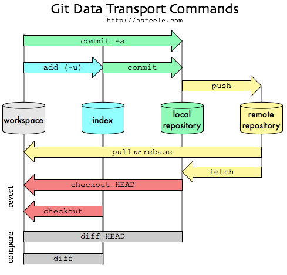

# GIT이란?
## ▶ 형상 관리 도구 중 하나로 버전 관리 시스템이라고도 불림
* ###### 소프트웨어를 개발하는 기업의 핵심 자산인 소스코드를 효과적으로 관리할 수 있게 해주는 무료, 공개소프트웨어
* ###### 컴퓨터 파일의 변경사항을 추적하고 여러 명의 사용자들 간에 헤당 작업 파일들의 조율을 위해 사용되는 분산 버전 관리 시스템

## GIT vs SVN
#### `SVN`은 중앙서버에 소스코드와 히스토리를 저장
#### BUT, `GIT`은 소스코드를 여러 개발 PC와 저장소에 분산해서 저장

## 장점
* ### 중앙 서버에 장애가 발생해도 로컬 저장소에 커밋을 할 수 있음
* ### 로컬 저장소들을 이용하여 중앙 저장소의 복원도 가능
* ### 사본을 로컬에서 관리하기 때문에 SVN에 비해 훨씬 빠름
    ###### SVN은 변경 로그 하나 보는 것도 인터넷을 경유해야 함
* ### 여러 명이 동시에 작업하는 병렬 개발이 가능
* ### 소스 코드의 변경 이럭을 쉽게 확인 가능
* ### 특정 시점에 저장된 버전과 비교하거나 특정 시점으로 롤백이 가능

## GIT의 용어들
* ### `Repository`
    저장소를 의미
    ###### 히스토리, 태그, 소스의 가지치기 혹은 branch에 따라 버전을 저장
* ### `Commit`
    변경사항을 로컬 저장소에 기록
* ### `Index`
    Commit을 하기 전 공간
* ### `Branch`
    일련의 작업을 독립적으로 만들기 위한 개념
* ### `push`
    원격 저장소에 Commit 내욜을 업로드
* ### `Merge`
    다른 Branch의 내용을 현재 Branch로 가져와 합치는 작업

## GIT 주요 명령어
* ### `git init`
    깃 저장소를 초기화
* ### `git clone`
    원격 저장소에서 local저장소로 복사
* ### `git log`
    커밋 내역을 확인

참고자료
 * [갓대희의 작은 공간](https://goddaehee.tistory.com/91)
 * [내일의 나는 오늘의 내가 만든다](https://velog.io/@shin6403/Git-%EC%9D%B4%EB%9E%80)
 * [java-man](https://java-man.tistory.com/12)