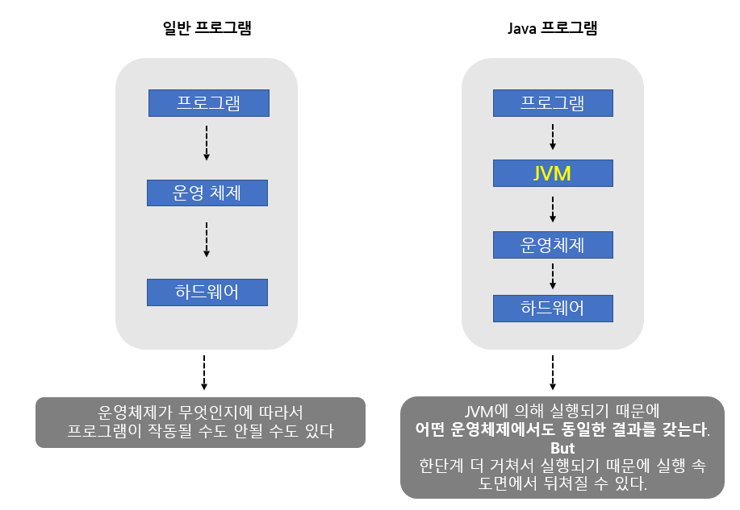
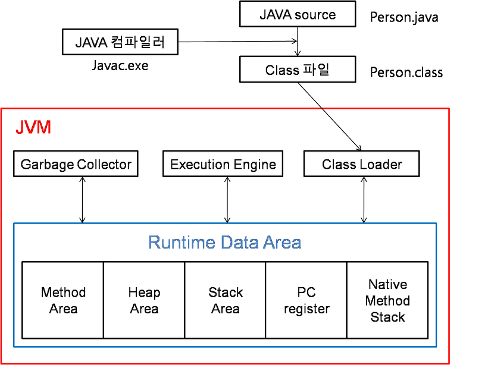
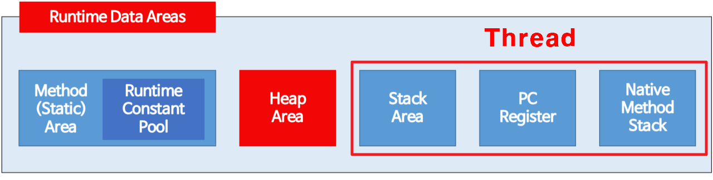
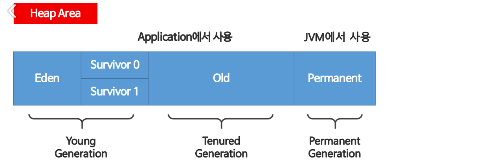

# Java Memory Structure

## 프로그램 메모리를 고려하는 이유
#### ▶ 보다 안정적인 프로그램 개발을 위해 메모리 구조를 이해하고 적절하게 사용할 수 있어야 함

## Java의 실행 구조

 

## JVM (Java Virtual Machine)
### ▶ 자바 가상 머신
* ### 자바와 운영체제 사이에서 중개자 역할을 하며, 운영체제에 구애 받지 않고 프로그램을 실행할 수 있도록 함
* ### 가비지 컬렉터를 사용한 메모리 관리를 자동으로 수행
* ### 레지스터 기반이 아닌 스택 기반

 

## JVM 구조

* ## `Clas Loader`
  * #### JVM내로 클래스 파일을 로드하고, 링크를 통해 배치하는 작업을 수행하는 모듈
  * #### .class 파일을 묶어서 JVM이 운영체제로부터 할당받은 메모리 영역인 Runtime Data Area로 적재
* ## `Execution Engine`
  * #### Runtime Data Area에 배치된 바이트 코드들을 명령어 단위로 읽어서 실행
* ## `Garbage Collector`
  * #### 사용하지 않는 메모리를 자동으로 회수
  * #### 힙 메모리 영역에 생성된 객체들 중에서 참조되지 않는 객체들을 탐색하여 제거
  * #### 역할을 하는 시간이 언제인지 정확히 알 수 없으며, 나머지 스레드들은 일시정지

## `Runtime Data Area`
### JVM의 메모리 영역으로, 프로그램 실행 시 사용되는 데이터들을 적재하는 영역

### ■ 모든 스레드가 공유하여 사용 (GC의 대상)
#### `힙(Heap)`, `메서드(Method)` 영역

### ■ 스레드(Thread) 마다 하나씩 생성
#### `스택(Stack)`, `PC 레지스터`, `네이티브 메서드 스택` 영역 

* ### `Method Area`
  * #### 클래스, 인터페이스, 메소드, 필드, static 변수 등이 저장되는 공간
  * #### JVM이 동작해서 클래스가 로딩될 때 생성되며, JVM이 종료될 때까지 유지
  * #### `Runtime Constant Pool` : 상수 정보가 저장되는 공간
* ### `Heap Area`
  * #### new 연산자로 생성된 객체, Array나 배열이 생성되는 영역
  
  * ### Young Generation
    * #### 자바 객체가 생성되자마자 저장
    * #### 최초에 Eden 영역에 할당, 이후 참조정도에 따라 Survivor로 이동되거나 회수
  * ### Tenured Generation
    * #### Young Generation 영역이 차면 참조정도에 따라 Old 영역으로 이동되거나 회수
    * #### Young과 Tenured Generation에서의 GC를 Minor GC라고 함
    * #### Old 영영의 메모리가 허용치를 넘으면, 참조되지 않는 객체들을 한꺼번에 삭제하는 Major GC가 실행
* ### `Stack Area`
  * #### 지역 변수, 메소드의 매개변수 등 잠시 사용되고 사라지는 데이터가 저장되는 공간
  * #### LIFO
  * #### 메소드가 호출되면 생성, 메소드 실행이 끝나면 pop되어 제거
* ### `PC Register`
  * #### 쓰레드가 생성되면서 생기는 공간
  * #### 현재 실행 중인 JVM 주소를 가지고 있음
* ### `Native Method Stack`
  * #### Java가 아닌 다른 언어로 구성된 메소드를 실행할 때 사용되는 공간

참고자료
* [Tape22](https://tape22.tistory.com/28)
* [코딩팩토리](https://coding-factory.tistory.com/828)
* [느리더라도 꾸준하게](https://steady-coding.tistory.com/305)