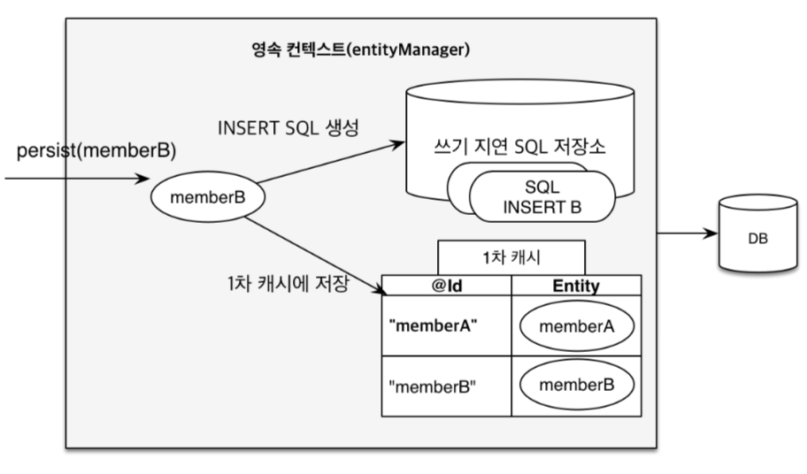
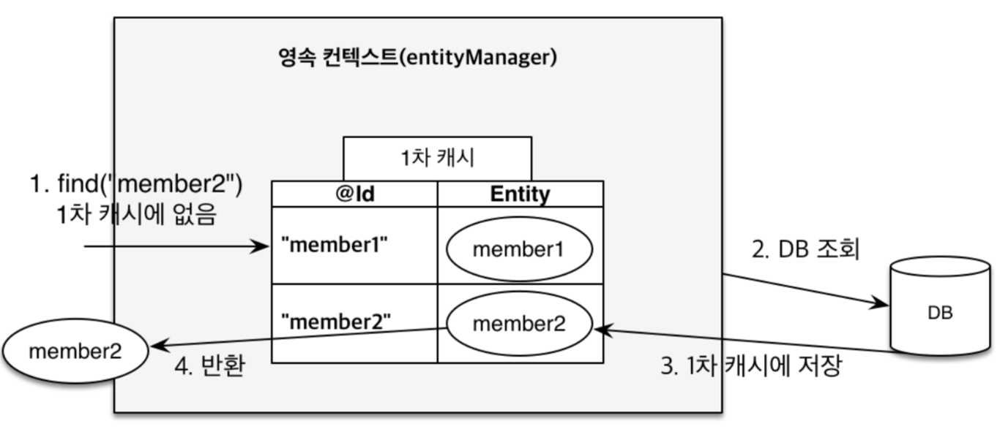

# 영속성 컨텍스트 (Persistence Context)
### ▶ 엔티티를 영구 저장하는 환경
### ▶ 애플리케이션과 데이터베이스 사이에서 객체를 보관하는 가상의 데이터베이스

## ● 엔티티 생명주기

* ### `비영속(new/transient)` : 영속성 컨텍스트와 전혀 관계가 없는 상태
  * #### 객체를 생성했지만 아직 영속성 컨텍스트에 저장하지 않은 상태
* ### `영속(managed)` : 영속성 컨텍스트에 저장된 상태
  * #### 엔티티 매니저를 통해 영속성 컨텍스트에 저장한 상태 (영속성 컨텍스트에 의해 관리)
* ### `준영속(detached` : 영속성 컨텍스트에 저장되었다가 분리된 상태
  * #### 관리하지 않은 영속 상태의 엔티티를 em.datach()로 만드는 상태
* ### `삭제(removed` : 삭제된 상태
  * #### 엔티티를 영속성 컨텍스트와 데이터베이스에서 삭제

 

## ● 특징
* ### 영속성 컨텍스트는 엔터티를 식별자로 구분
* ### `flush` : 새로 저장된 엔터티를 데이터베이스에 반영

## ● 장점
* #### 1차 캐시
* #### 동일성을 보장함
* #### 트랜잭션을 지원하는 쓰기 지연
* #### 변경을 감지
* #### 지연 로딩

# 1차 캐시
### ▶ 영속성 컨텍스트 내부에 있는 캐시
### ▶ 영속 상태의 엔티티가 모두 저장되는 장소

참고자료
* [neptunes032.log](https://velog.io/@neptunes032/JPA-%EC%98%81%EC%86%8D%EC%84%B1-%EC%BB%A8%ED%85%8D%EC%8A%A4%ED%8A%B8%EB%9E%80)
* [정리하는 것도 공부다!](https://velog.io/@seungho1216/JPA%EC%98%81%EC%86%8D%EC%84%B1-%EC%BB%A8%ED%85%8D%EC%8A%A4%ED%8A%B81%EC%B0%A8-%EC%BA%90%EC%8B%9C)