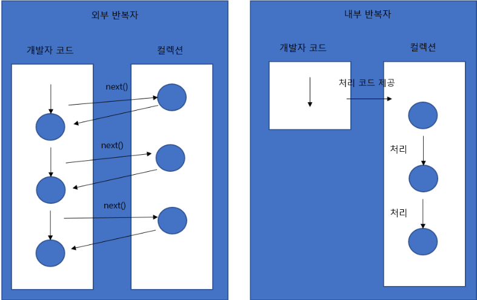

# 스트림
#### ▶ 자바 8부터 추가된 컬렉션의 저장 요소를 하나씩 참조해서 람다식으로 처리할 수 있도록 해주는 반복자

# 특징
### ① 람다식으로 요소 처리코드 제공
### 자바 7 이전 코드
```java
List<String> list = Arrays.asLIst("홍길동", "심청", "콩쥐");
Iterator<String> iterator = list.iterator();
while(iterator.hasNext()){
    String name = iterator.next();
    System.out.println(name);
}
```
### 자바 8 이후 코드
```java
List<String> list = Arrays.asList("홀길동", "심청", "콩쥐");
Stream<String> stream = list.stream();
stream.forEach(name -> Sytem.out,println(name));
```

### ② 병렬 처리 (Parallelism)
### 한 가지 작업을 서브 작업으로 나누고, 서브 작업들을 분리된 스레드에서 병렬적으로 처리한 후, 서브작업들의 결과물들을 최종 결합



### ③ 내부 반복자
* #### 컬렉션 내부에서 요소들을 반복시키고 개발자는 요소당 처리해야할 코드만 제공하는 코드 패턴
* #### 개발자는 요소 처리 코드에만 집중 가능
* #### 멀티코어 CPU를 최대한 활용하기 위해 요소들을 분배시켜 병렬 처리 작업 가능

### ④ 스트림 파이프라인
* #### `리덕션(Reduction)` : 대량의 데이터를 가공해서 축소하는 것 (합계, 평균값, 카운팅, 최댓값, 최솟값 등을 집계)
    * #### 요소가 리덕션의 결과물로 바로 집계할 수 없을 경우 중간처리가 필요
    * #### 중간 처리 -> 필터링, 매핑, 정렬, 그룹핑
    * #### 중간 처리한 요소를 최종 처리하여 리덕션 결과물 산출
* #### 스트림은 중간 처리와 최종처리를 파이프라인으로 해결
* #### `파이프라인` : 스트림을 파이프처럼 이어 놓은 것
    * #### 중간처리 메소드(필터링, 매핑, 정렬 등)는 중간 처리된 스트림을 리턴
    * #### 이 스트림에서 다시 중간 처리 메소드를 호출하여 파이프라인 형성
    * #### 최종 스트림의 집계 기능이 시작되기 전까지 중간 처리는 지연