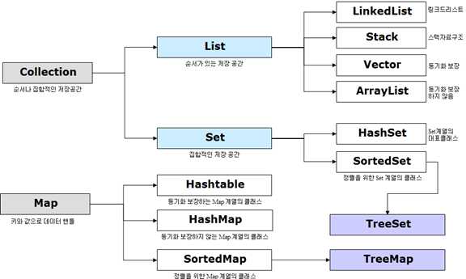

#Java Collection이란?
### ▶ `데이터의 집합, 그룹`

## Collection을 사용하는 이유
* ### `일관된 API`
    #### Collection의 일괄된 API를 사용하여 Collection 밑에 있는 모든 클래스(ArrayList,Vector,LinkedList 등) Collection에서 상속받아 통일된 메서드를 사용
* ### `프로그래밍 노력 감소`
    #### 객체 지향 프로그래밍의 추상화의 기본 개념이 성공적으로 구현
* ### `프로그램 속도 및 품질 향상`
    #### Collection API를 사용하여 더 쉬운 구현과 성능 향상

## List Interface
* ### `ArrayList`
    #### 동적 배열을 제공