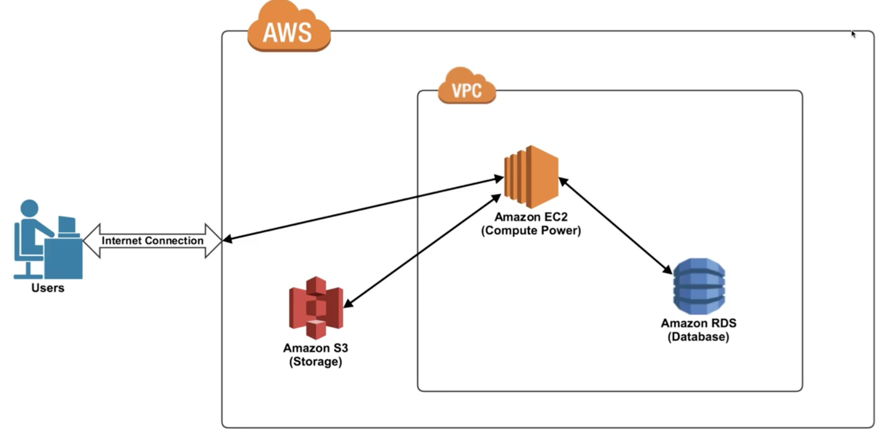

# AWS
#### ▶ 아마존에서 개발한 클라우드 컴퓨팅 플랫폼

## 클라우드 컴퓨팅?
* #### 컴퓨터가 가상의 공간에 있다고 가정하고 자유롭게 사용 가능한 것
* #### 기존의 물리적인 형태로 실물 컴퓨팅 리소스를 네트워크 기반 서비스 형태로 제공하는 것
* #### 제공하는 서비스에 따라 3가지로 분류
  * ### IaaS(Infrastructure as a Service)
    * #### AWS, 네이버 플랫폼과 같은 인프라스트럭쳐를 제공하는 서비스
    * #### 가상 서버 또는 스토리지, 가상 네트워크 등의 리소스를 서비스 형태로 제공
  * ### PaaS(Platform as a Service)
    * #### DB 또는 Application 서버 등의 미들웨어 제공
    * #### 하드웨어/OS/미들웨어에 대한 관리는 서비스 제공자가 하며, 사용자는 제공된 미들웨어만 사용가능
    * #### 주로 개발 환경과 관련된 서비스 제공(OS, DB, WAS, JDK 등)
  * ### SaaS(Software as a Service)
    * #### 소프트웨어 또는 애플리케이션의 기능만 제공
    * #### 네이버/구글 클라우드, 웹 메일, ERP 등과 같은 형태의 서비스 제공

## AWS의 장점
* ### 확장성 (Scalability)
    #### 요금을 지불하는 만큼 리소스같은 서비스 확장이 가능
* ### 탄력성 (Elasticity)
    #### 트래픽이 몰리는 시기 또는 시간에만 리소스를 확장했다가 반납 가능
* ### 높은 접근성(High Availability)
    #### 언제 어디서든 클라우드에 접근 및 서비스 이용 가능
* ### 장애 허용성 (Fault Tolerance)
    #### 데이터를 여러 곳에 저장해두어 장애 발생시에도 데이터가 안전

## AWS 서비스

* ### VPC (Virtual Private Cloud)
  #### 가상 서버에 올려진 것들의 공개 여부를 결정 할 수 있음
* ### EC2 (Elastic Cloud Compute)
  * #### VPC안에 등록하는 대표적인 가상 컴퓨터
  * #### 가상의 공간에 등록되는 개인 컴퓨터
  * #### 코드를 넣어 동작하게 하는 컴퓨터(웹 호스팅 서버)로 사용
* ### RDS (Relational Database Service)
  * #### 관계형 데이터 베이스를 서비스하는 기능
  * #### MySQl, MariaDB, OracleDB, SQLServer, Amazone Aurora 등을 지원
  * #### `기능적 서비스` : 자동 백업, 데이터베이스 스냅샷, 자동 호스트(하드웨어) 교체 등
  * #### `관리 서비스` : 모니텅링 및 지표 제공, 이벤트 알림 등
  * #### `보안 서비스` : 저장 데이터 및 전송 데이터 암호화, 네트워크 격리, 리소스 수준 권한 등
* ### S3 (Simple Storage Service)
  * #### 파일 서버의 역할을 하는 서비스
  * #### 저장할 수 있는 파일 수에 제한이 없으며, 용량 또한 원하는데로 설정 할 수 있음
  * #### 권한을 부여하여 파일 접근에 제한을 둘 수 있음
  * #### 정보의 중요도에 따라 보호수준을 달리하여 비용을 절감 할 수 있음 (RSS)

참고자료
* [호박너구리 블로그](https://blog.pumpkin-raccoon.com/26)
* [갓대희의 작은공간](https://goddaehee.tistory.com/174)
* [DevelopersIO](https://dev.classmethod.jp/articles/for-beginner-rds-explanation/)
* [DevelopersIO](https://dev.classmethod.jp/articles/for-beginner-s3-explanation/)