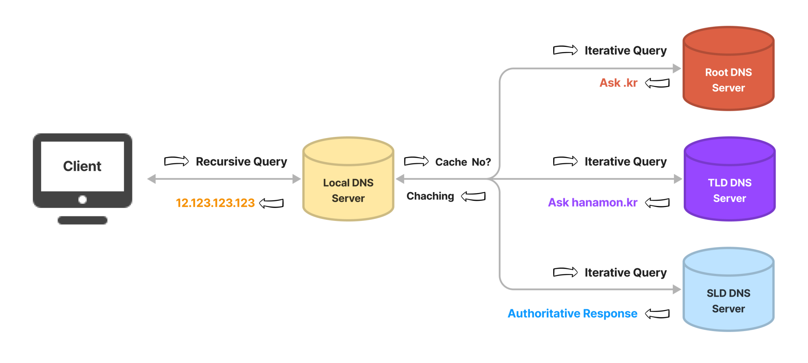

# DNS(Domain Name System)란?
### ▶ 도메인 이름을 실제 네트워크상에서 사용하는 IP주소로 바꾸고, 접속하는 과정
  ###### IP 주소 대신 도메인을 사용함으로써 접속을 용이하게 함
  ###### 상위 기관에서 인증된 기관에게 도메인을 생성하거나 IP주소로 변경할 수 있는 권한을 부여
  ###### 계층 구조를 가지는 분산 데이터베이스 구조

## DNS 구성요소
### `도메인 네임 스페이스(Domain Name Space)`
#### 도메인 네임의 계층적 구조 공간
#### 네임 주소 영역을 분배, 할당, 구성하는 방식을 제공하며 트리 형태의 계층적 구조로 이루어짐

 
   
#### ★ `리소스 레코드(Resorce Record)`
###### 도메인 네임 중에서 지정된 도메인 네임에 대해 필요한 인터넷 자원 정보를 매핑하는 수단을 제공
###### 하나의 도메인 네임이 가지는 속성 정보를 지정하는 수단으로 zone 파일을 사용

### `네임서버(Name Server)`
#### 도메인 zone의 정보를 소유하고 이에 대한 질의에 응답하는 역할을 하는 서버
###### 문자열로 표현된 도메인 이름을 실제 컴퓨터가 통신할 때 사용하는 IP 주소로 변환시키기 위해서는 도메인 네임 스페이스의 트리 구조에 대한
###### 정보가 필요한데 이러한 정보를 가지고 있는 서버

### `리졸버(Resolver)`
#### DNS 클라이언트의 요청을 네임 서버로 전달하고 네임 서버로부터 정보를 받아 클라이언트에게 제공

## DNS Query
### ▶ DNS 클라이언트와 DNS 서버 사이에 교환되는 정보
### `Recursive Query(재귀적 질의)`
### 결과물(IP주소)을 돌려주는 작업
### `Iterative Query(반복적 질의)`
* ### Recursive DNS 서버가 다른 DNS 서버에게 쿼리를 보내어 응답을 요청하는 작업
* ### Recursive 서버가 권한 있는 네임 서버들에게 반복적으로 쿼리를 보내어 결과물(IP주소)을 알아냄
    ###### Recursive 서버에 이미 IP 주소가 캐시 되어 있다면 해당 과정은 건너뜀

## DNS 동작 과정
### ① 클라이언트가 브라우저에 방문하고자 하는 사이트 주소 입력
### ② IPS가 브라우저·OS·라우터·IPS의 캐시를 확인하여 방문 여부 확인
### ③ ISP가 DNS에 쿼리를 전달
### ④ 네임 서버에서 IP 주소가 반환
### ⑤ ISP가 클라이언트에게 해당 주소의 웹 페이지를 불러옴

참고자료
* [cloudflare](https://www.cloudflare.com/ko-kr/learning/dns/what-is-dns/)
* [hanamon](https://hanamon.kr/dns%EB%9E%80-%EB%8F%84%EB%A9%94%EC%9D%B8-%EB%84%A4%EC%9E%84-%EC%8B%9C%EC%8A%A4%ED%85%9C-%EA%B0%9C%EB%85%90%EB%B6%80%ED%84%B0-%EC%9E%91%EB%8F%99-%EB%B0%A9%EC%8B%9D%EA%B9%8C%EC%A7%80/)