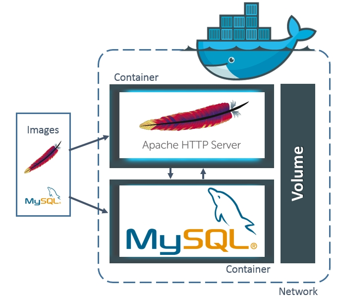
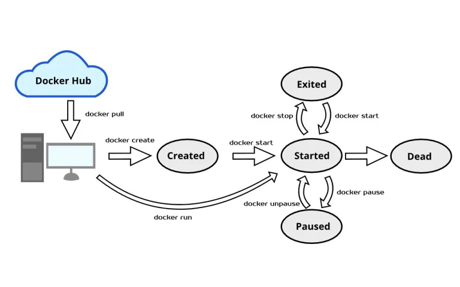

# Docker
* ### 애플리케이션을 신속하게 구축, 테스트 및 배포할 수 있는 소프트웨어 플랫폼
* ### `리눅스 컨테이너` 기술을 기반으로 하는 오픈 소스 서비스
  * #### Linux 기반의 기술
  * #### 라이브러리와 애플리케이션을 모아서 별도의 서버처럼 구성한 것
  * #### 시스템 자원을 각 컨테이너가 독립적으로 소유
* #### 애플리케이션 실행 환경을 코드로 작성
* #### OS를 공유, 격리화하여 관리

## 특징
### ① 프로세스의 구획화
 * #### 특정 컨테이너의 프로세스는 해당 컨테이너 안에서만 액세스 가능
 * #### A 컨테이너의 프로세스는 B 컨테이너의 프로세스에 영향을 줄 수 없음

### ② 네트워크의 구획화
 * #### 컨테이너마다 IP 주소가 할당 되어 있음 → 하나의 컴퓨터 하나의 IP 극복

### ③ 파일 시스템의 구획화
* #### 컨테이너 안에서 사용되는 파일 시스템 구획화
* #### 해당 컨테이너에서의 명령이나 파일 등의 액세스를 제한할 수 있음

### ④ Image

### 컨테이너를 실행할 수 있는 실행파일과 설정 값을 가지고 있는 것

 

## 공유와 격리
### 공유
* #### CPU 성능(하드웨어)
* #### 메모리(하드웨어)
* #### 리눅스 커널(호스트 OS)
### 격리
* #### 네트워크(IP, PORT)
* #### 파일
* #### 프로세스

## Docker를 사용해야 하는 이유
* ### 더 많은 소프트웨어를 빨리 제공
  #### 필요할 때마다 격리된 서비스를 제공
* ### 운영 표준화
  #### 손쉽게 배포 및 문제파악, 롤백 등이 가능 
* ### 원활하게 이전
  #### AWS의 프로덕션 배포로 원활하게 이전
* ### 비용 절감
  #### 각 서버에서 많은 코드를 실행하여 사용률을 높이고 비용 절감

## Docker Container Lifecycle

참고자료
* [HANAMON](https://hanamon.kr/%EB%8F%84%EC%BB%A4%EB%9E%80-docker-%ED%95%84%EC%9A%94%EC%84%B1/)
* [AWS](https://aws.amazon.com/ko/docker/)
* [하진쓰의 서버사이드 기술 블로그](https://khj93.tistory.com/entry/Docker-Docker-%EA%B0%9C%EB%85%90)