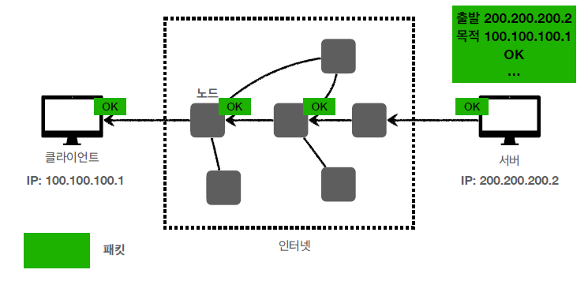
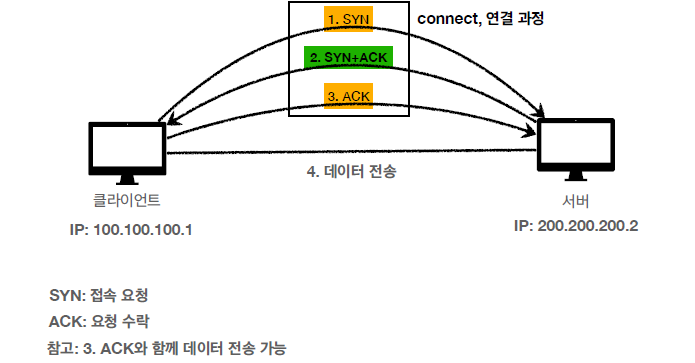

# IP(Internet Protocol)
#### ▶ 복잡한 인터넷 망 속에서 클라이언트와 서버간 원활하게 통신할 수 있는 규칙
#### ▶ 지정한 IP 주소에 데이터를 전달하는 역할을 함
#### ▶ 패킷(Packet) 단위로 데이터 전달

## ■ 데이터 전달 과정

### IP 주소가 담긴 패킷을 인터넷 망의 여러 노드를 통해 서버로 전달
 

### 서버에서 확인 신호를 다시 클라이언트에게 전달
 

## ■ IP의 한계
* ### 비연결성
    #### 패킷을 받을 상대가 없거나 서비스 불능 상태여도 패킷이 전송됨
    ###### 서버의 상황을 클라이언트가 알 방법이 없음
* ### 비신뢰성
    * #### 패킷이 전송 중 소실되어도 확인이 불가능
    * #### 쪼개어 보낸 데이터가 어떤 순서로 도착했는지 확인 불가
* ### 프로그램 구분
    #### 같은 IP에서 애플리케이션을 다수 실행하면, 어떤 애플리케이션이 패킷을 보낸 것인지 확인 불가

# TCP (Transmission Control Protocol)
#### ▶ 두 개의 호스트를 연결하고 데이터 스트림을 교환하게 해주는 네트워크 프로토콜
#### ▶ TCP의 패킷으로 감싸고 IP 패킷으로 감싸서 데이터 전달
###### `TCP 패킷` : 출발지 PORT, 목적지 PORT, 전송 제어, 순서, 검증 정보 등의 정보로 구성

## ■ 특징
* ### 연결 지향 (TCP 3 Way Handshake)
  #### 클라이언트와 서버의 연결을 확인하고 데이터를 전송하는 특징
  
  ### ① 클라이언트가 SYN 패킷(서버에 접속 요청)을 보냄
  ### ② 서버는 SYN 패킷을 받고, 클라이언트에게 ACK 패킷(접속 요청 수락)과 SYN 패킷을 보냄
  ### ③ 클라이언트가 서버에게 ACK 패킷을 보내어 서버간 연결 확인
* ### 데이터 전달 보증
  #### 전송 중에 데이터가 소실되거나 누락되면 클라이언트가 알 수 있음
* ### 순서 보장
  #### TCP 세그먼트의 정보를 바탕으로 잘못된 순서로 데이터가 전송되면 재전송을 요청

# UDP (User Datagram Protocol)
#### ▶ 데이터를 데이터그램 단위로 처리하는 프로토콜
#### ▶ IP에 Port, 체크섬 필드 정보만 추가된 프로토콜

## ■ 특징
* ### 기능이 거의 없음
* ### 단순하고 처리가 빠름
* ### 애플리케이션에서 추가 작업이 필요

# HTTP

참고자료
* [shitai.koto](https://velog.io/@shitaikoto/CS-IP-TCP-UDP-HTTP)
* [우당탕당 개발](https://jiyoon-park.tistory.com/entry/HTTP-%EC%9D%B8%ED%84%B0%EB%84%B7-%ED%94%84%EB%A1%9C%ED%86%A0%EC%BD%9C%EC%9D%B4-%EB%AD%90%EC%95%BCIP-TCP-UDP)
* [dahliachoi](https://dahliachoi.tistory.com/26)