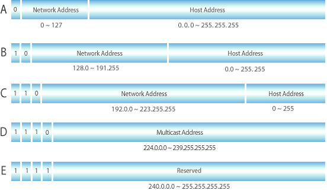
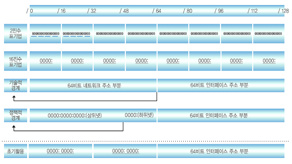

# IP(Internet Protocol)
#### 인터넷에 연결되어 있는 모든 장치들을 식별할 수 있도록 각각의 장비에게 부여되는 고유주소

# IP 종류
* ### 고정 IP
  * #### 변하지 않고 컴퓨터에 고정적으로 부여된 IP
  * #### IP를 반납하기 전까지 다른 장비에 부여할 수 없음
  * #### 보안성이 우수
* ### 유동 IP
  * #### 사용되지 않는 IP 주소를 임시로 발급
  * #### 접속 종료시 반납
* ### 공인 IP
  * #### ICANN에서 국가별로 IP 대역을 관리
  * #### 한국은 한국인터넷진흥원(KISA)에서 IP주소 관리
  * #### IPS(Internet Service Provider)가 IP를 부여 받고 가입자에게 제공
* ### 사설 IP
  * #### 공유기에 연결될 경우 부여 받는 IP
  * #### 공유기는 공인 IP를 할당 받고 내부적으로는 사설 IP를 사용

# IPv4
#### 전 세계적으로 사용된 첫 번째 인터넷 프로토콜
* #### 32비트 방식으로, 8비트씩 4자리로 이루어짐(온점으로 구분)
  #### 0.0.0.0 ~ 255.255.255.255 (10진수 표시)
* #### 약 43억개의 주소 할당 가능
  #### → 현재 전 세계적으로 사용자 수가 급증하여 고갈위기에 처함
* #### A,B,C,D,E 클래스로 나누어 주소 부여
  
  * #### `A,B,C` : 일반 사용자에게 부여하는 네트워크 구성용 클래스
  * #### `D` : 멀티캐스트용 클래스
  * #### `E` : 향후 사용을 위해 예약된 주소 클래스

# IPv6
#### IPv4의 주소 고갈을 해결하기 위해 등장한 프로토콜
* #### 128비트 방식으로, 16비트씩 8자리로 구성(콜론으로 구분)
  #### 0000:0000:0000:0000:0000:0000:0000:0000 ~ ffff:ffff:ffff:ffff:ffff:ffff:ffff:ffff (16진수 표시)
* #### 43억^4개의 주소 할당 가능
  #### → IPv4의 한계 극복
* #### RIP(regional Internet Registry) 협의에 기초하여 정책적 경계를 나누어 부여
  

# IPv4 vs IPv6
|  구분  |IPv4|IPv6|
|:----:|:---:|:---:|
| 주소길이 |32비트|128비트|
| 표시방법 |8비트씩 4부분으로 10진수 표시|16비트씩 8부분으로 16진수표시|
|주소개수|약 43억개|약 43억^4개|
|주소할당|클래스 단위로 할당|네트워크 규모 및 단말기 수에 따라 할당|
|품질제어|지원 수단 없음|등급별, 서비스별로 패킷 구분이 가능해 품질보장 용이|
|보안기능|IPsec 프로토콜 별로 설치|확장기능에서 기본 제공|
|플러그 앤드 플레이|지원 수단 없음|지원|
|모바일IP|할당 곤란|용이|
|웹캐스팅|할당 곤란|용이|

참고자료
* [KISA](https://xn--3e0bx5euxnjje69i70af08bea817g.xn--3e0b707e/jsp/resources/ipv6Info.jsp)
* [매일의 공부 기록](https://study-recording.tistory.com/7)