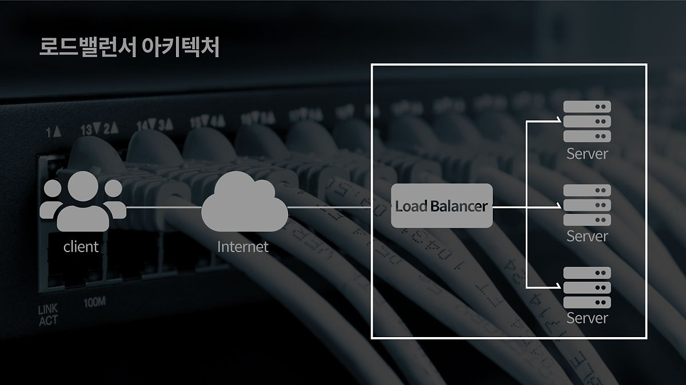

# 트래픽에 대처할 수 있는 방법
## Scale-up
* 기존 서버의 성능을 확장하는 방식 (예 - 서버의 CPU를 업그레이드)
## Scale-down
* 기존 서버와 동일하거나 낮은 성능의 서버를 증설하는 방식 (예 - 같은 성능의 서버 여러 대 추가 구입 운영)
* ### 이 방식의 경우 여러 대의 서버로 트래픽을 균등하게 분산하는 `로드밸런싱`이 꼭 필요함

# Load Balancing
#### ▶ 컴퓨터 네트워크 기술의 일종으로 둘 혹은 셋 이상의 중앙처리장치 혹은 저장장치와 같은 컴퓨터 자원들에게 작업을 나누는 것
#### 쉽게 말해 서버에 가해지는 부하(로드)를 분산(밸런싱)해주는 장치 또는 기술을 통칭

### 클라이언트와 서버풀 사이에 위치하며, 한 대의 서버로 부하가 집중되지 않도록 트래픽을 관리해 각각의 서버가 최적의 퍼포먼스를 보일 수 있도록 함

# 종류
* ## L4 로드밸런싱
    Transport 계층을 사용하며 IP 주소와 포트 번호 부하 분산이 가능
  * ## NLB(Network LoadBalancer)
    * #### Client IP와 서버사이에 서버로 들어오는 트래픽은 Load Balancer를 통하고 나가는 트래픽은 Client IP와 직접 통신
    * #### NLB는 Security Group 적용이 되지 않아서 서버에 적용된 Security Group에서 보안이 가능
      * `Security Group` : 가상 방화벽의 기능을 수행하며 연결된 리소스에 도달하거나 이를 떠날 수 있는 트래픽을 제어
    * #### Client → Server에서 Access 제한 가능
    * #### NLB는 할당한 Elastic IP를 Static IP로 사용이 가능하며 DNS Name과 IP주소 모두 사용이 가능
     * `Elastic IP` : 인터넷을 통해 접속할 수 있는 고정적인 공인 IP주소를 할당하고, 인스턴스에 연결할 수 있는 서비스
     * `Static IP` : ISP에 의해 해당 사용자 전용으로 부여되는 인터넷 주소
    * #### Name Server 또는 Route 53에서 A Record 사용이 가능
    * `Route 53` : AWS에서 제공하는 DNS
    * `A Record` : 도메인이 연결된 웹 서버의 IP
  * ## ALB(Application LoadBalancer)
    * #### Reverse Proxy대로 Client IP와 서버사이에 들어오고 나가는 트래픽이 모두 Load Balancer와 통신
    * #### CLB/ALB는 Security Group을 통한 보안이 가능
    * #### Client → Load Balancer의 Access 제한 가능
    * #### ALB/CLB는 IP주소가 변경되어 Client에서 Access할 ELB의 DNS Name을 이용해야 함
    * #### Name Server 또는 Route 53에서 CNAME을 사용해야 Domain Name 연동이 가능
        * `CNAME` : 도메인 주소를 또 다른 도메인 주소로 매핑 시키는 형태의 DNS 레코드 타입

| 종류  |                                                         L4 L/B                                                         |                                                           L7 L/B                                                           |
|:---:|:----------------------------------------------------------------------------------------------------------------------:|:--------------------------------------------------------------------------------------------------------------------------:|
| 특징  |                                                 TCP/UDP 포트 정보를 바탕으로 함                                                  |                                    TCP/UDP 정보는 물론 HTTP의 URL, FTP의 파일명, 쿠키 정보 등을 바탕으로 함                                     |
| 장점  | ○ 데이터 안을 들여다보지 않고 패킷 레벨에서만  로드를 분산하기 때문에 속도가 빠르고 효율이 좋음  ○ 데이터의 내용을 복호화할 필요가 없기 떄문에 안전  ○ L7로드밸런서보다 가격이 저렴 |          상위 계층에서 로드를 분산하기 때문에  훨씬 더 섬세한 라우팅이 가능  ○ 캐싱 기능을 제공  ○ 비정상적인 트래픽을 사전에 필터링할 수 있어 서비스 안전성이 높음           |
| 단점  |                  ○ 패킷 내용을 살펴볼 수 없기 때문에 섬세한 라우팅이 불가능  ○ 사용자의 IP가 수시로 바뀌는 경우라면 연속적인 서비스 제공이 어려움                  | ○ 패킷의 내용을 복호화해야 하기에 더 많은 비용이 필요  ○ 클라이언트가 로드밸런서와 인증서를 공유해야하기 때문에  공격자가 로드밸런서를 통해서 클라이언트에 데이터 접근할 보안 상의 위험성이 존재 |

# 알고리즘
* ### 라운드로빈(Round Robin Method)
  * 서버에 들어온 요청을 순서대로 돌아가며 배정하는 방식
  * 해당하는 서버들의 성능이 동일하고, 세션이 오래 지속되지 않는 경우에 활용하기 적합
* ### 가중 라운드로빈 방식(Weighted Round Robin Method)
  * 각 서버에 가중치를 매기고 가중치가 높은 순서대로 배분
  * 서버간 트래픽 처리 능력이 상이한 경우 적합한 방식
* ### IP 해시 방식(IP Hash Method)
  * 클라이언트의 IP 주소를 특정 서버로 매핑하여 요청을 처리하는 방식

참고자료
* [가비아](https://m.post.naver.com/viewer/postView.naver?volumeNo=27046347&memberNo=2521903)
* [Tecoble](https://tecoble.techcourse.co.kr/post/2021-11-07-load-balancing/)
* [DevelopersIO](https://dev.classmethod.jp/articles/load-balancing-types-and-algorithm/)