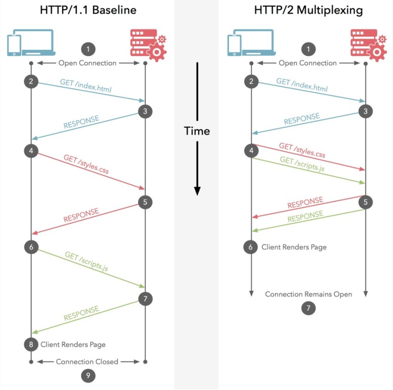
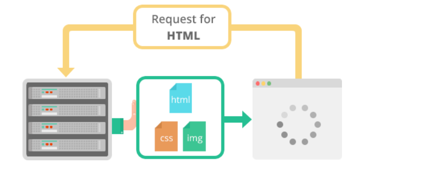
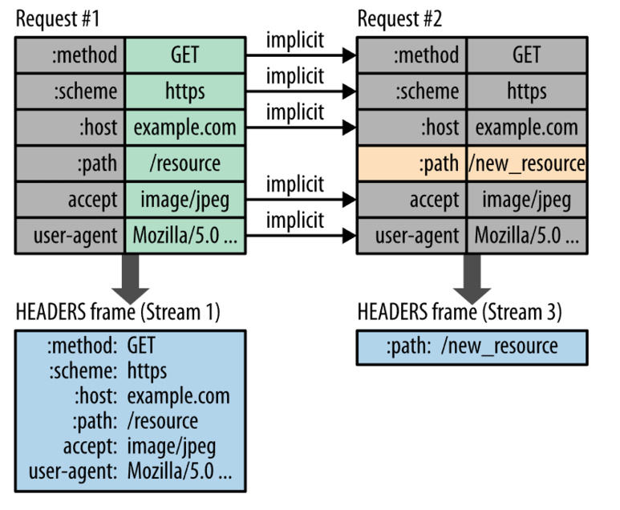

# HTTP(HyperText Transfer Protocol)
#### ▶ 웹에서 정보를 교환하기 위한 전송 프로토콜
#### ▶ 웹 기반이며 웹을 구성하는 기술 그 자체

# ● 초기 HTTP
* ### 단일 라인 구성
* ### get이 유일한 메서드
* ### HTML 파일만 전송 가능

# ● HTTP/1.0
* ### 요청에 버전 정보가 추가되어 전송
* ### 응답 시작 부분에 상태 코드 추가
* ### 모든 요청과 응답에 헤더 개념 추가

# ● HTTP/1.1
#### ▶ HTTP의 첫 번째 표준버전으로 기존의 HTTP에 많은 개선사항을 도입

## 특징
* ### 파이프라이닝 기술로 레이턴시를 낮춤
    ###### `파이프라이닝` : 연결 하나 당 하나의 요청을 처리(요청과 응답이 순차적으로 처리됨)
* ### Connection Keep-Alive으로 handshake 생략
    ###### `Connection Keep-Alive` : 한 번 연결 후 연결을 유지하는 기술
* ### 캐시 제어 메커니즘
* ### HTML외에도 여러 컨텐츠 전송 가능

## 단점
* ### HTTP HOLB(Head of Line Blocking)
    #### 순서대로 처리하는 파이프라이닝 기술로 인해 기존 요청의 시간이 지연되면, 뒤에 들어오는 요청들은
    #### 앞의 요청이 완료될 때까지 대기해야함
* ### RTT(Round Trip TIme)
    #### TCP의 특징인 Handshake가 반복적으로 발생하여,
    #### 불필요한 RTT 증가와 네트워크 지연을 초래하여 성능 저하
* ### Heavy Header
    #### http요청 마다 중복된 헤더 값을 전송 -> 서버 도메인에 쿠키 정보도 헤더에 함께 포함되어 전송

# ● HTTP/2
#### ▶ HTTP/1.1에 SPDY의 개선사항과 성능향상에 초점을 맞춘 프로토콜
#### `SPDY` : 구굴에서 더 빠른 Web 구현을 위해 Latency 관점에서 HTTP를 고속화한 프로토콜

## 특징
* ### Multiplexed Streams
    * #### 한 번의 연결로 동시에 여러 개의 메시지를 주고 받을 수 있음
    * ##### 응답 역시 순서에 상관없이 stream으로 주고 받음
* ### Stream Prioritization
    #### 리소스 간의 의존 관계에 따른 우선 순위를 설정하여 리소스 문제 해결 (이미지파일 보다 CSS파일을 우선 수신)
* ### Server Push
    * #### 서버가 클라이언트가 요청하지 않은 리소스를 전송
    * #### 클라이언트의 HTML 문서 요청 최소화
    
* ### Header Compression
    * #### Header 정보를 압축하는데 HPACK 압축방시 사용
    * #### 중복 Header 값을 Static/Dynamic Header Table 개념을 사용하여 검출
    * #### 중복된 Header는 index 값만 전송
    * #### 중복되지 않은 Header 값은 Huffman Encoding 기법으로 처리하여 전송
    

# ● HTTP/3
#### ▶ 기존처럼 TCP 기반이 아닌 UDP를 기반으로 한 프로토콜
#### ▶ 구글에서 만든 QUIC에 기반
#### `QUIC` : UDP를 기반으로 TCP + TLS + HTTP의 기능을 모두 구현하는 프로토콜

## 특징
* ### RTT 감소로 인한 지연 시간 단축
  * #### TCP 기반이 아니기 때문에 Handshake 과정을 거치지 않음
  * #### 연결 설정을 하면서 데이터를 함께 보냄
* ### 클라이언트의 IP가 바뀌어도 연결 유지
  #### Connection ID를 사용하여 IP가 변경되어도 기존의 연결을 계속 유지