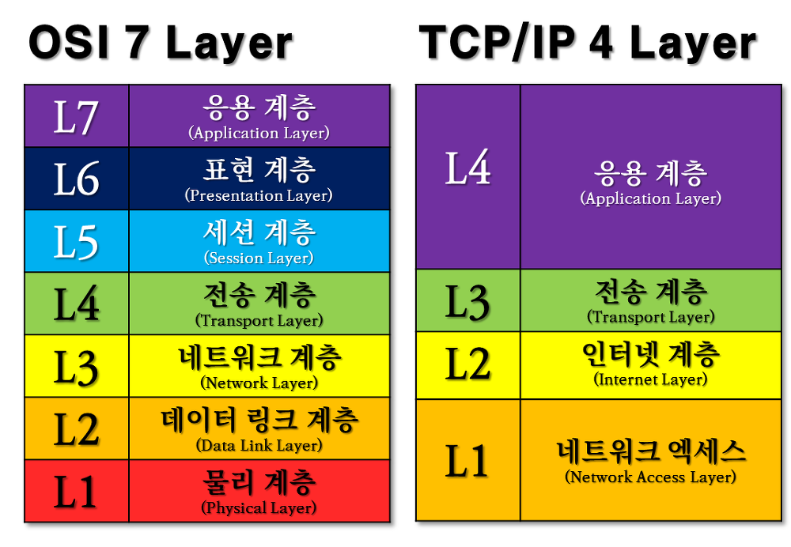

OSI-7계층
===========

OSI 7계층이란?
============
> * 네트워크에서 통신이 일어나는 과정을 7단계로 나눈것
> * 국제표준화기구(ISO,International Organization for Standardization)에서 네트워크 간의 호환을 위해 만듬

 

OSI 7계층 단계별 역할
==================
###1.물리 계층(Physical Layer)
> * 실제 장치를 연결하기 위한 전기적 및 물리적 세부 사항을 정의한 계층
> * 전기적 신호가 물리적인 장치에 의해 통신하는 계층 (인터넷 케이블, 라우터 스위치 등)
> * 물리적인 연결을 통하여 인접한 두 장치의 간의 신뢰성 있는 정보 전송을 담당(Point-To-Point 전송)

 

###2.데이터 링크 계층(Data link Layer)
> * 장치 간 신호를 전달하는 물리계층을 이용하여 네트워크 상의 주변 장치들 간의 데이터를 전송하는 역할
> * 두 지점(장치)간의 신뢰성 있는 전송을 보장하기 위한 계층
> * 전송단위 '프레임(Frame)', 대표장비 '브리지,스위치 등'

 

###3.네트워크 계층(Network Layer)
> * 다양한 길이의 데이터를 네트워크들을 통해 전달
> * 전송 계층이 요구하는 서비스 품질(QoS)을 제공하기 위한 기능적, 절차적 수단을 제공
> * 경로를 선택 / 주소를 정하고 경로에 따라 패킷을 전달해주는 것이 주 역할
> * 데이터 단위 '패킷(Packet)', 장비 '라우티, L3 스위치 등'

 

###4.전송 계층(Transport Layer)
> * 통신을 활성화하기 위한 계층 (TCP 프로토콜을 이용, 포트를 열어 응용프로그램 전송)
> * 송신자와 수신자 간의 신뢰성있고 효율적인 데이터를 전송하기 위하여 오류검출 및 복구, 흐름제와 중복검사 등을 수행
> * 데이터 전송을 위해 'Port 번호'를 사용
> * 데이터 단위 '세그먼트(Segment)', 대표적 프로토콜 'TCP, UDP'

 

###5.세션 게층(Session Layer)
> * 통신 장치 간 상호작용 및 동기화를 제공
> * 이 계층의 프로토콜은 통신 연결이 손실되는 경우 연결 복구 시도가 가능, 장시간 연결이 되지 않으면 세션 계층의 프로토콜이 연결을 닫고 재연결 시도

 

###6.표현 계층(Presentation Layer)
> * 데이터를 어떻게 표현할지 정하는 계층
> * 송신자에게서 온 데이터를 해석하기 위한 응용계층 데이터 부호화, 변화
> * 데이터의 암호화와 복호화

 

###7.응용 계층(Application Layer)
> * 응용 프로세스와 직접 관계하여 일반적인 응용 서비스를 수행하는 계층
> * 응용 프로세스 간의 정보 교환을 담당

 

참고자료
* [onecoin-life : OSI 7Layer / 7계층 개념 및 역할, 구조까지 한번에 알아보기](https://onecoin-life.com/19)
* [cgotjh.log : OSI 7계층 (OSI 7 Layer) 기본 개념, 각 계층 설명](https://velog.io/@cgotjh/%EB%84%A4%ED%8A%B8%EC%9B%8C%ED%81%AC-OSI-7-%EA%B3%84%EC%B8%B5-OSI-7-LAYER-%EA%B8%B0%EB%B3%B8-%EA%B0%9C%EB%85%90-%EA%B0%81-%EA%B3%84%EC%B8%B5-%EC%84%A4%EB%AA%85)