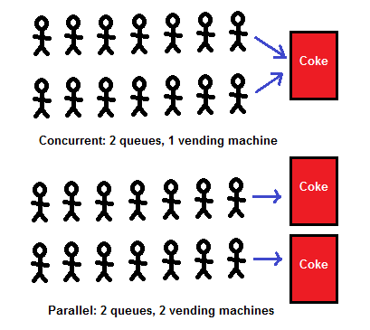

# Cuncurrency (병행성)
▶ 빠르게 전환하며 여러 작업을 수행하여 동시에 여러 작업이 실행되는 것처럼 보이는 것
###### 운영체제의 스케줄링 정책에 의해 Task들이 복잡하게 엉켜져 있는데, 이들의 순서를 정하기 어려우니 동시에 실행된다고 생각하는 것

* ### Single Core
  * 물리적으로 병렬이 아닌 순차적으로 동작
  * 실제로는 Time-sharing으로 CPU를 나눠 사용함으로써 사용자가 Concurrency를 느낄 수 있도록 함
* ### Multi Core
  * 물리적으로 병렬 동작
* ## ※ Task가 동시에 수행될 때 동기화 문제가 발생 할 수 있음

# Parallelism (병렬성)
▶ 여러 코어에서 여러 작업을 동시에 수행
###### 하나의 작업이 여러 하위 작업들로 나뉘고 각각 하위 작업들이 CPU를 할당 받아서 동시에 수행되는 것

* ### 오직 Multi core에서만 가능
* ## ※ 여러 작업을 동시에 수행하기 때문에 race condition 혹은 동기화 문제가 발생할 수 있음
### `race condition`
###### 두 개 이상의 프로세스가 공통 자원을 병행적으로 읽거나 쓰는 동작을 할 때, 공용 데이터에 대한 접근이 어떤 순서에 따라 이우러졌는지에 따라
###### 그 실행 결과가 같지 않고 달라지는 상황  (예방방법으로 `Semaphore`와 `Mutex`)

# Cuncurrency VS Parallelism
|      Cuncurrency       |       Parallelism       |
|:----------------------:|:-----------------------:|
|   동시에 실행되는 것처럼 보이는 것   |     실제로 동시에 실행되는 것      |
| 논리적(Logical level)인 개념 | 물리적(Physical level)인 개념 |
|    싱글코어, 멀티코어에서 가능     |       멀티코어에서만 가능        |

## ★ `Concurrency`는 어떠한 흐름 내에서 두 가지 이상의 작업을 나누어 실행하는 것
###### N개의 코어가 있다면, N개의 코어 각각 내부에서 일어나느 작업의 분할 혹은 프로세스의 독립 실행
## ★ `Parallelism`은 N개의 코어가 각각 흐름을 소유하고, 이 흐름이 동시에 일어나는 것

참고자료
* [spacebike](https://spacebike.tistory.com/22)
* [Nesoy Blog](https://nesoy.github.io/articles/2018-09/OS-Concurrency-Parallelism)
* [블랙라군](https://m.blog.naver.com/PostView.naver?isHttpsRedirect=true&blogId=fkrns1744&logNo=221755781443)