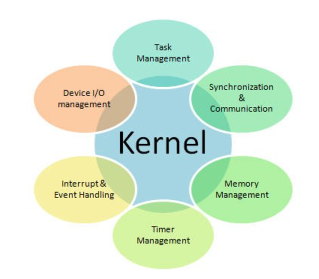
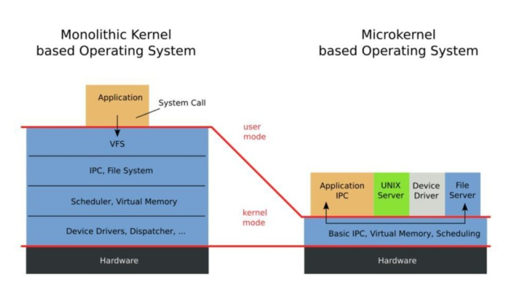

# Kernel
* #### 하드웨어와 컴퓨터 자원들을 관리하는 역할하는 운영체제의 핵심 부분
  * #### 하드웨어를 추상화하여 응용 프로그램 간의 인터페이스 역할을 함
* #### Kernel은 자원만을 바라보고(관리하고) 있기 때문에 사용자와 직접적인 상호작용을 하지 않음
  * #### 쉘(Shell)이라는 명령어 해석기 등을 이용하여 상호작용

## 커널의 역할

* ### `Task Management` : 물리적 자원(CPU)를 추상적 자원(Task)로 제공
* ### `Memory Management`: 물리적 자원(Memory)를 추상적 자원(Page 또는 Segment)로 제공
* ### `File System` : 물리적 자원(Disk)를 추상적 자원(File)로 제공
* ### `Network Management` : 물리적 자원(Network Device)를 추상적 자원(Socket)으로 제공
* ### `Device Driver Management` : 외부 장치(디바이스)에 대한 접근을 관리(디바이스 드라이버)
* ### `Interrupt Handling` : 인터럽트 핸들러
* ### `I/O Communication` : 입출력, 통신 관리

## 커널의 유형

### 모놀리식 커널
* ### Application을 제외한 서비스들을 커널이 직접 처리 하는 방식
  * #### 여러 계층으로 나누어 관리
  * #### 커널의 크기가 큰 단점이 있지만, 시스템 자원을 서로 공유하여 효율적
  * #### 시스템 콜 형태로 사용
  * #### 빠른 처리속도를 가짐
  * #### 하나의 오류가 전체 시스템에 영향을 미침
  * #### 최신 모놀리식 커널은 여러 개의 모듈로 구성되어 추가, 수정이 수월

### 마이크로 커널
* ### 모놀리식 커널에서 핵심 서비스만을 남겨 가볍게 만든 커널
  * ### 각 서비스가 개별적인 서버의 형태로 존재
  * ### 프로세스간 통신을 통해 서비스 수행
  * ### 시스템 복잡도가 증가될 수록 시스템 부하·오버헤드가 증가할 수 있음
  * ### 서버 방식이기에 커널을 변경하지 않고도 기능을 추가, 수정할 수 있음
  * ### 독립된 서버로 운영되기에 하나의 오류가 전체에 영향을 주지 않음

## 부트로더(Boot Loader, 초기적재프로그램)
#### 운영체제가 시동되기 전에 미리 실행되어 커널을 준비시켜 운영 체제를 시동시키기 위한 프로그램

## 유저 영역 vs 커널 영역
### `유저 영역` : 프로그램이 동작하기 위해 사용되는 메모리 공간(stack, heap, bss, data, text 영역)
### `커널 영역` : 운영체제를 실행시키이 위한 메모리 공간
#### 운영체제 실행에 사용되는 자원을 일반 사용자가 접근하지 못하도록 하기 위하여 영역을 나눔

참고자료
* [프로그래민](https://minkwon4.tistory.com/295)
* [GonnabeAlright](https://velog.io/@ragnarok_code/OS-%EC%BB%A4%EB%84%90kernel%EC%9D%B4%EB%9E%80)