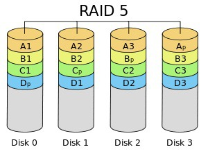
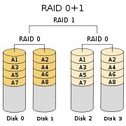
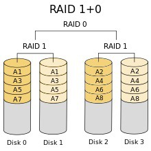

# RAID

### ▶ Redundant Array of Independent/Inexpensive Disk

### ▶ 여러 개의 디스크를 묶어 하나의 디스크 처럼 사용하는 기술

### ▶ 여러 개의 하드 디스크에 중복된 데이터를 나눠서 저장하는 기술

 

## ■ 기대효과

* #### 데이터의 복구 (안정성 향상)
* #### 대용량의 단일 볼륨
* #### I/O 병렬화로 인한 성능 향상

 

## ■ RAID Level

* ### RAID 0
  
    * #### RAID를 구성하는 모든 디스크에 데이터를 똑같이 분할하여 저장하는 방식
    * #### 최소 2개의 디스크가 필요
    * #### 성능은 디스크의 개수의 비례 (N배)
    * #### 안정성이 매우 떨어짐
    * #### 하나에 문제가 생기면 전체가 문제
* ### RAID 1
  
    * #### RAID를 구성하는 각각의 디스크에 데이터를 똑같이 복제 (미러링)
    * #### 최소 2개의 디스크가 필요
    * #### 실제 사용 가능 용량은 단일 디스크와 동일
    * #### 쓰기 성능은 낮으나, 읽기 성능은 N배
    * #### 안정성이 높음
    * #### 비용 문제로 인해 거의 사용하지 않음
* ### RAID 2
  
    * #### 기록용 저장공간과 복구용 저장공간을 분리하여 구성하는 방식
    * #### n+1개의 데이터 디스크와 n개의 패리티 디스크로 구성
    * #### 최소 3개의 디스크 필요
    * #### 1개의 디스크 에러 시 복구가 가능하지만, 2개 이상의 경우 복구 불가
    * #### 기록용 저장 공간의 효율성 문제로 현재는 사용되지 않음
    * #### Bit 단위로 스트라이핑
* ### RAID 3
  
    * #### 패리티 디스크를 1개 사용하는 방식
    * #### 최소 3개의 디스크가 필요
    * #### 전체 개수 대비 1개의 성능 감소가 발생하는 구성
    * #### 1개의 디스크 에러 시 복구가 가능하지만, 2개 이상의 경우 복구 불가
    * #### 패러티 디스크의 잦은 입/출력으로 인해 디스크 수명 감소
    * #### Byte 단위로 스트라이핑
* ### RAID 4
  
    * #### RAID 3와 같은 방식
    * #### Block 단위로 스트라이핑
    * #### 블록 단위로 저장하여 한 번의 작업으로 데이터를 읽을 수 있어 높은 성능 발휘
* ### RAID 5
  
    * #### 에러 체크 및 수정을 위한 패리티 정보를 매번 다른 디스크에 저장
    * #### 최소 3개의 디스크가 필요
    * #### 용량 및 성능이 N-1배 증가
    * #### 1개의 디스크 에러 시 복구가 가능하지만, 2개 이상의 경우 복구 불가
* ### RAID 6
  
    * #### RAID5에 에러 검출 및 수정을 위한 패리티 블록을 추가한 이중 방식
    * #### 패리티 저장 디스크를 고정하지 않고, 매 번 다른 디스크에 저장
    * #### 최소 4개의 디스크가 필요
    * #### RAID 5 대비 성능/용량을 줄이고 안정성을 높인 방식
    * #### 성능이 N-2배 증가
    * #### 2개의 디스크 에러 시 복구가 가능하지만, 3개 이상의 경우 복구 불가
* ### Nested RAID
  * ### RAID 0 + 1
    
  * ### RAID 1 + 0
    

참고자료
* [Park's Life](https://harryp.tistory.com/806)
* [STEVEN J. LEE](https://www.stevenjlee.net/2020/03/01/%EC%9D%B4%ED%95%B4%ED%95%98%EA%B8%B0-raid-%EA%B5%AC%ED%98%84-%EB%B0%A9%EC%8B%9D%EA%B3%BC-%EC%A2%85%EB%A5%98%EC%97%90-%EB%8C%80%ED%95%98%EC%97%AC/)