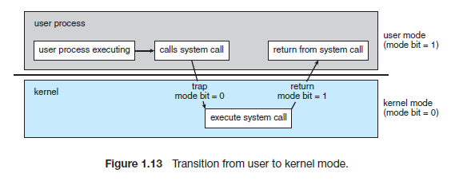
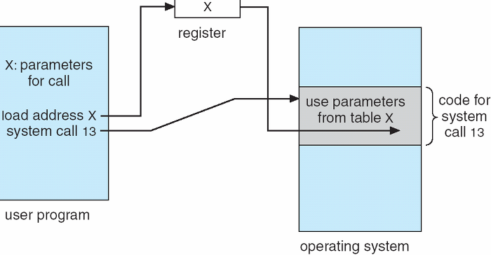

# System Call
#### ▶ 운영체제의 커널이 제공하는 서비스에 대해, 응용 프로그램의 요청에 따라 커널에 접근하기 위한 인터페이스
#### ▶ 고급 API를 통해 시스템 호출에 접근하게 하는 방법
### ▶ 운영체제는 커널 모드와 유저모드로 나뉘어 구동되는데, 커널 영역의 기능(프로세스가 하드웨어에 직접 접근하여 필요한 기능 수행)을 유저 모드가 사용 가능하게 함

## System Call이 필요한 이유
* #### 응용프로그램(유저 레벨의 함수)은 기능이 한정되기 때문에 커널의 도움을 받아 더 다양한 기능을 구현
* #### 시스템 콜과 권한을 통해 해커의 침입과 잘못된 호출로 인한 피해를 막기 위함

## System Call 동작

### ※ 운영체제에 매개변수를 전달하는 방법
* #### 매개변수를 CPU 레지스터 내에 전달
* ### 매개변수를 메모리에 저장하고 메모리의 주소가 레지스터에 전달
    ###### 전달되는 매개변수들의 개수나 길이를 제한하지 않기 때문에 이 방법을 많이 사용
* #### 매개변수는 프로그램에 의해 스택으로 전달 될 수도 있음

## System_Call의 유형
### ■ 프로세스 제어 (Process Control)
* #### 끝내기(end), 중지(abort)
* #### 적재(load), 실행(execute)
* #### 프로세스 생성(create process)
* #### 프로세스 속성 획득과 설정(get process attribute and set process attribute)
* #### 시간 대기(wait time)
* #### 사건 대기(wait event)
* #### 사건을 알림(signal event)
* #### 메모리 할당 및 해제 : malloc, free

### ■ 파일 조작(File Manipulation)
* #### 파일 생성(create file), 파일 삭제(delete file)
* #### 열기(open), 닫기(close)
* #### 읽기(read), 쓰기(write), 위치 변경(reposition)
* #### 파일 속성 획득 및 설정(get file attribute and set file attribute)

### ■ 장치 관리(Device Management)
* #### 장치를 요구(request devices), 장치를 방출(release device)
* #### 읽기, 쓰기, 위치 변경
* #### 장치 속성 획득, 장치 속성 설정
* #### 장치의 논리적 부착(attach) 또는 분리(detach)

### ■ 정보 유지 (Information Maintenance)
* #### 시간과 날짜의 설정과 획득(time)
* #### 시스템 데이터의 설정과 획득(date)
* #### 프로세스 파일, 장치 속성의 획득 및 설정

### ■ 통신 (Communication)
* #### 통신 연결의 생성, 제거
* #### 메시지의 송신, 수신
* #### 상태 정보 전달
* #### 원격 장치의 부착 및 분리

참고자료
* [luckyyowu](https://luckyyowu.tistory.com/133)
* [limjunho](https://limjunho.github.io/2021/05/11/SystemCall.html)
* [chaos and order](https://fjvbn2003.tistory.com/306)
* [DR-Kim](https://dar0m.tistory.com/264)