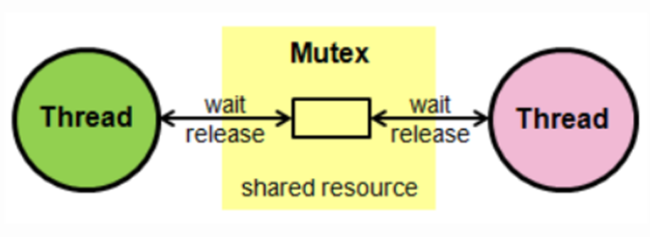
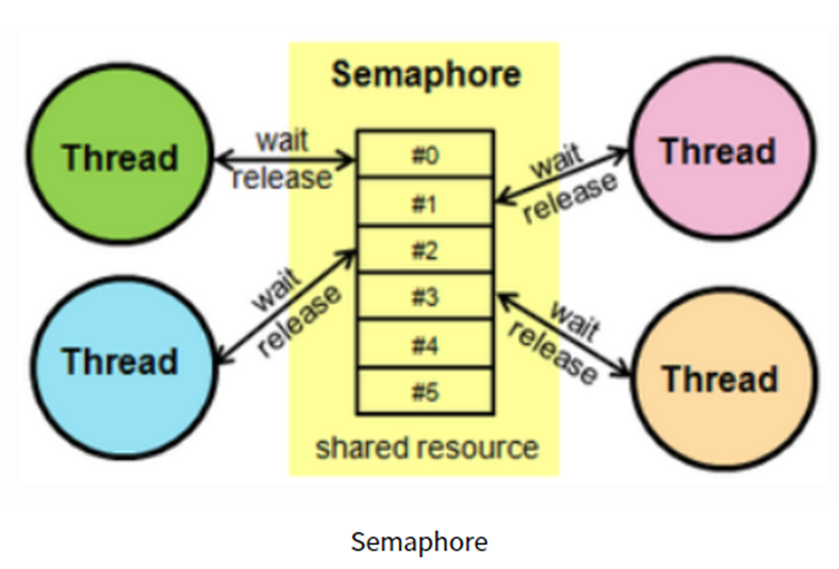

# Semaphore 와 Mutex
* ##  프로세스 간 메시지를 전송하거나, 공유메모리를 통해 공유된 자원에 여러 개의 프로세스가 동시에 접근하면 `Critical Section` 문제가 발생
* ## 이를 해결하기 위해 데이터를  한 번에 하나의 프로세스만 접근할 수 있도록 제한을 두는 동기화 박식을 취해야 하는 대표적으로 `뮤텍스(Mutex)`와 `semaphore`가 있음

##`임계구역(Critical Section)`
##### 여러 프로세스가 데이터를 공유하며 수행될 때, 각 프로세스에서 공유 데이터를 접근하는 프로그램 코드 블록

## Mutex
##### ▶ 공유된 자원의 데이터 혹은 임계영역 등에 하나의 Process 혹은 Thread가 접근하는 것을 막아줌
###### 임계구역을 가진 스레드들의 실행시간이 서로 겹치지 않고 각각 단독으로 실행되도록 하는 기술

* 한 프로세스에 의해 소유될 수 있는 key를 기반으로 한 상호배제 기법
###### key에 해당하는 어떤 객체가 있으며, 이 객체를 소유한 스레드/프로세스만이 공유자원에 접근
* 다중 프로세스들의 공유 리소스에 대한 접근을 조율하기 위해 동기화 또는 락을 사용
###### 뮤텍스 객체를 두 스레드가 동시에 사용할 수 없음

## 예시) 화장실이 하나 밖에 없는 식당
* ### 카운터에 키가 있으면 화장실에 사람이 없다는 뜻이며 열쇠를 이용하여 화장실을 이용할 수 있음
* ### 카운터에 키가 없다면 화장실에 사람이 있다는 뜻이며 화장실을 이용할 수 없고 대기
* ### 만일 먼저 들어간 사람이 키를 반납하면 대기 인원 중 가장 앞사람이 화장실 이용
`사람` : 프로세스/스레드, `화장실` : 공유자원, `화장실 키` : 공유자원에 접근하기 위한 오브젝트

## Semaphore
##### ▶ 공유된 자원의 데이터 혹은 임게역역 등에 여러 Process 혹은 Thread가 접근하는 것을 막아줌

* 사용하고 있는 스레드/프로세스의 수를 공통으로 관리하는 하나의 값을 이용해 상호배제
* 공유 자원에 접근할 수 있는 프로세스의 최대 허용치만큼 동시에 사용자가 접근, 각 프로세는 세마포어의 값을 확인하고 변경
* 자원을 사용하지 않는 상태가되면, 대기하던 프로세스가 즉시 자원을 사용, 다른 프로세스에서 사용 중이라면 일시 대기

## 예시) 여러 칸의 화장실이 있는 레스토랑
* ### 화장실 입구에 빈칸의 개수를 보여주는 정광판이 존재
* ### 화장실에 입장하려면 정관판의 빈칸 개수 -1을 하고 입장, 사용 후에는 빈칸의 개수 +1
* ### 모든 칸에 사람이 들어가면 빈 칸의 개수는 0, 대기 중인 사람은 빈 칸이 1 혹은 양수가 되도록 대기
`사람` : 쓰레드/프로세스, `화장실` : 공유자원, `화장실 빈칸의 개수` : 공유자원의 사용가능한 쓰레드,프로세스 개수

참고자료
* [우당탕탕 하온이네](https://heeonii.tistory.com/14)