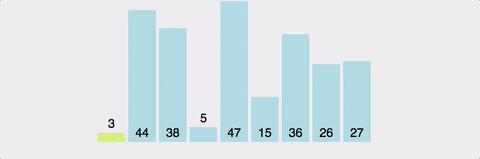
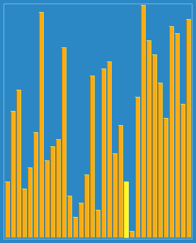

# 정렬 알고리즘(Sorting Algorithm)

## ① 선택 정렬(Selection Sort)
### ▶ 주어진 배열에서 가장 작은값(오름차순) 또는 큰 값(내림차순)을 찾아 배열의 가장 앞에서 부터 위치를 바꾸면서 정렬하는 방식

### 시간 복잡도 `O(n^2)`
### ○ 특징
* ### 장점
  * 비교횟수는 많지만 실제로 값을 바꾸는 횟수는 적음.
  * 구현이 간단하며, 데이터를 하나씩 비교하기 때문에 정밀한 비교가 가능
* ### 단점
  * 데이터를 하나씩 비교하기 때문에 많은 시간이 소요
  * 정렬된 상태에서 새로운 데이터를 추가하면 정렬 효율이 좋지 않음

## ② 버블 정렬(Bubble Sort)
### ▶ 연속된 두 개의 인덱스를 비교하며, 큰 값(오름차순) 또는 작은 값(내림차순)을 가장 끝으로 보내 정렬하는 방식

### 시간 복잡도 `O(n^2)`
### ○ 특징
* ### 장점
  * 구현이 간단하며, 데이터를 하나씩 비교하기 때문에 정밀한 비교가 가능
* ### 단점
  * 데이터를 하나씩 비교하기 때문에 많은 시간이 소요

## ③ 삽입 정렬(Insertion Sort)
### ▶ 버블 정렬의 비효율성을 개선하기 위한 방법
* ### i번째 원소를 i-1번째부터 0번째 원소를 비교하여 해당 원소보다 작은 값을 발견하면 그 위치에 삽입하는 방식

### 시간 복잡도 `O(n^2)`
### ○ 특징
* ### 장점
  * 입력으로 들어오는 배열의 원소가 정렬되어있을수록 속도가 빠름
  * 정렬된 값은 교환되지 않음
* ### 단점
  * 삽입을 구현하므로 속도가 자료구조의 영향을 많이 받음
  * 입력으로 들어오는 배열이 역순으로 정렬되어 있을 경우 효율이 매우 떨어짐

## ④ 병합 정렬(Merge Sort)
### ▶ 배열을 작은 단위로 쪼개어 정렬 후 다시 합치며 정렬하는 방식

### 시간복잡도
### (분할 + 합병)`O(NlogN)`
### ○ 특징
* ### 장점
  * 항상 일정한 시간 복잡도`O(NlogN)`를 가짐
  * 안정적이며 대부분의 경우에서 좋은 성늠을 냄
* ### 단점
  * 추가 메모리 공간이 필요함

## ⑤ 퀵 정렬(Quick Sort)
### ▶ 하나의 기준 값을 정하여 이 값보다 작은 값은 왼쪽에 큰 값은 오른쪽에 위치시키며 정렬하는 방식

### 시간 복잡도
### 평균 `O(NlogN)`, 최악 `O(N^2)`
### ○ 특징
* ### 장점
  * 평균 실행 시간이 빠름
* ### 단점
  * 기준 값을 어떻게 설정하느냐에 따라 성능의 차이가 발생
  * 안정성이 좋지 않음

## ⑥ 힙 정렬(Heap Sort)
### ▶ 최대 힙 트리(내림차순)나 최소 힙 트리(오름차순)를 구성하여 정렬하는 방식

###### 힙(Heap)이란?
###### 완전 이진 트리의 일종으로 우선순위 큐를 위해 만들어진 자료구조
###### ■ 최대 힙 트리 : 부모 노드의 키 값이 자식 노드의 키 값보다 크거나 같은 완전 이진 트리
###### ■ 최소 힙 트리 : 부모 노드의 키 값이 자식 노드의 키 값보다 작거나 같은 완전 이진 트리
### 시간 복잡도 `O(NlogN)`
### ○ 특징
* ### 장점
  * 항상 같은 시간 복잡도를 가지기 떄문에 성능이 준수
* ### 단점
  * 같은 시간 복잡도를 가지는 다른 정렬 알고리즘과 비교하면 성능이 떨어짐

## ⑦ 셀 정렬(Shell Sort)
### ▶ 삽입 정렬의 문제점을 해결하기 위한 방법
* ### 배열을 간격이라고 하는 일정한 기준에 따라 분류하여 여러 개의 부분 배열을 생성하여 이를 각각 삽입 정렬로 정렬
* ### 다시 전체 배열을 여러 개의 부분 배열로 나누어 각각 삽입 정렬 `(전 단계보다 배열을 더 작게 설정해야 함)`
* ### 위의 과정을 반복하여 나누어진 배열의 개수가 1이 될 때까지 시행

### 시간복잡도 `O(NlogN)`
### ○ 특징
* ### 장점
  * 삽입 정렬의 문제점을 해결함으로써 성능이 좋음
* ### 단점
  * 간격을 어떻게 설정하느냐에 따라 성능의 차이가 발생

