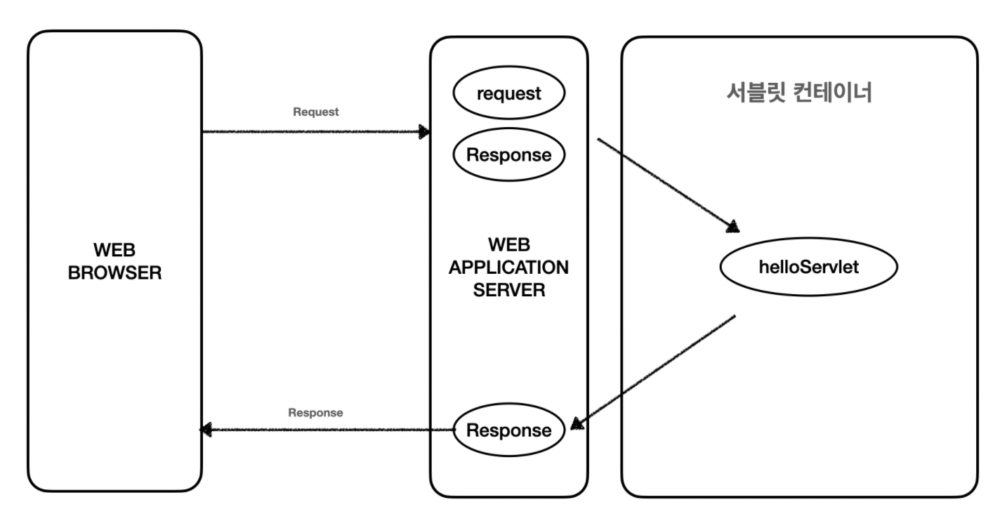
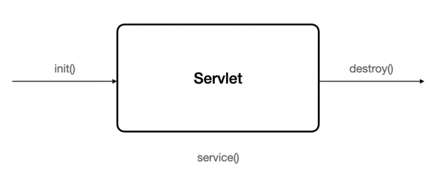

# Servlet
#### ▶ 웹 프로그래밍에서 클라이언트 요청을 처리하고 처리 결과를 클라이언트에 전송하는 기술
 * 자바를 사용하여 동적으로 생성하는 서버측 프로그램 혹은 그 사양

## 특징
 * 클라이언트의 요청에 대해 동적으로 작동하는 웹 어플리케이션 컴포넌트
 * `html`을 사용해서 요청에 응답
 * Java thread를 통해 동작
 * **MVC패턴중 Controller로 이용**
 * HTTP 프로토콜 서비스를 지원하는 javax.servlet.http.HttpServlet 클래스를 상속 받음(UDP보다 속도가 느림)
 * HTML 변경시 Servlet을 재 컴파일 해야함

## 동작 과정

* ### 사용자가 URL을 입력하면 요청이 서블릿 컨테이너로 전송됨
* ### 요청을 전송받은 서블릿 컨테이너가 HttpRequest, HttpResponse 객체를 생성
* ### 사용자가 요청한 URL이 어느 서블릿에 대한 요청인지 찾음 (hello Servlet)
* ### 서블릿의 service() 메소드를 호출한 후 클라이언트의 GET, POST 여부에 따라 doGet(), doPost() 메소드를 호출
* ### 동적 페이지를 생성한 HttpServletResponse 객체에 응답을 보냄
* ### 클라이언트에 최종 결과를 응답한 후 HttpServletRequest, HttpServletResponse 객체를 소멸

## 생명주기

* ### 클라이언트 요청이 들어오면 컨테이너가 해당 서블릿이 메모리에 존재하는지 확인
    ### 없을 경우 init() 메소드를 호출해 적재
    ### 서블릿의 쓰레드에서 공통적으로 사용해야 하는 것이 있다면 오버라이딩 하여 구현
* ### 클라이언트 요청에 따라 service() 메소드를 통해 요청에 대한 응답이 doGet(), doPost()로 분기
    ### HttpServletRequest, HttpServletResponse에 의해 request와 response 객체가 제공
* ### 컨테이너가 서블릿에 종료 요청을 하면 destory() 메소드가 호출됨
    ### 종료 시 처리해야 하는 작업은 destory() 메소드를 오버라이딩하여 구현

## Servlet Container
* ### 구현되어 있는 Servlet 클래스의 규칙에 맞게 서블릿 객체를 `생성, 초기화, 호출, 종료하는 생명주기를 관리`
    ### 클라이언트의 요청을 받고 응답할 수 있도록 웹 서버와 소켓으로 통신
    * ### Tomcat
      ### WAS중 하나로 자바 웹 프로그래머가 작성한 Servlet을 관리

참고자료
* [기본기를 쌓는 정아마추어 코딩블로그](https://jeong-pro.tistory.com/222)
* [느리더라도 꾸준하게](https://steady-coding.tistory.com/599)
* [코헴](https://kohen.tistory.com/29)