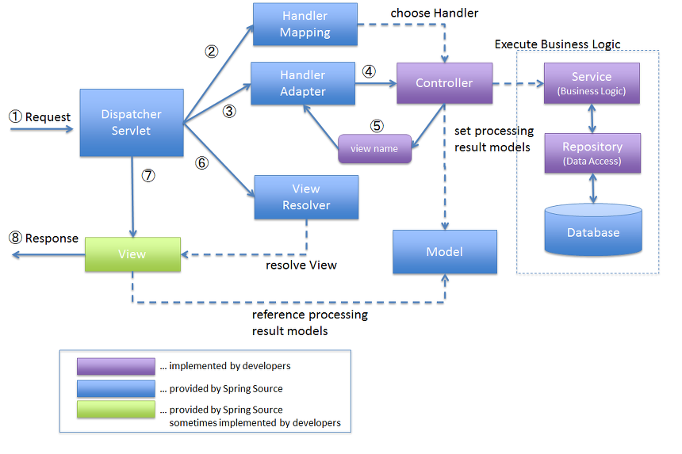

# Spring MVC
#### ▶ Spring에서 제공하는 웹 모듈
#### ▶ Model, View, Controller 세 가지 구성요소를 사용
#### ▶ 사용자의 다양한 HTTP Request를 처리하고 단순한 텍스트 형식의 응답부터 REST 형식의 응답,   
#### View를 표시하는 html을 return하는 응답까지 다양항 응답을 할 수 있도록 하는 프레임워크

## MVC의 구조
* ### DispatcherServlet (Front Controller)
    * #### 부모 클래스에서 HttpServlet을 상속받아 사용하며, 서블릿으로 동작
    * #### Http Request가 왔을 때 처리할 Controller 지정
      ###### 일종의 Super Controller 역할을 함
 * ### Controller (Handler)
    * #### HTTP Request를 처리해 Model을 만들고 View를 지정
    * #### HTTP Request의 메시지를 처리해 필요 데이터를 Model에 저장
    * #### HTTP Request에 따라 HTTP가 보여줄 View Name을 지정
        ###### View뿐 아니라 View를 직접 반활할 수 있음
* ### ModelAndView
    * #### Controller에 의해 반환된 Model과 View가 Wrapping된 객체
    * #### Model은 Map 자료구조 → HTTP Request 속의 데이터를 파싱해 Key-Value 쌍으로 만들어 저장
    * #### View, View Name은 ViewResolver에서 그릴 View를 지정
* ### ViewResolver
  * #### ModelAndView 객체를 처리해 View를 그림
    ###### 모델에 저장된 데이터를 사용해 View를 그림

## Spring MVC의 의의
#### HTTP Request 처리의 Controller, 데이터 처리·정제된 데이터 수집의 Model, 정제된 데이터 활용의 View에 대한 역할 분리가 매우 잘 되어있음
#### Spring MVC를 사용하면 Model·View·Controller 모두를 인터페이스를 사용해 규격화 해놓았기에, 유연하고 확장성 있게 웹 어플리케이션을 설게 가능

# Spring Process

#### ① DispatcherServlet이 모든 웹 브라우저로부터 요청을 받음
#### ② DispatcheServlet은 HandlerMapping으로 부터 주어진 request를 처리할 수 있는 Handler객체를 가져옴
#### ③ 가져온 Handler를 실행 시킬 수 있는 HandlerAdapter객체를 가져옴
#### ④ 만약 해당 Controller를 처리할 Handler 객체에 적용할 interceptor가 존재한다면 모든 interceptor객체의 preHandle메소드를 호출
#### ⑤ HanlderAdapter객체를 통해 실제 컨트롤러의 메소드를 실행 후 ModelAndView를 얻음
#### ⑥ 만약 해당 Controller를 처리할 Handler 객체에 적용할 interceptor가 존재한다면 모든 interceptor객체의 postHandle메소드를 호출
#### ⑦ DispatcherServlet이 5번 과정에서 얻은 ModelAndView를 통해 view name을 ViewResolver에 전달하여 응답에 필요한 View객체를 얻음
#### ⑧ DispatcherServlet은 위에서 얻은 View객체에 5번 과정에서 얻은 ModelAndView의 Model을 파라미터로 넘겨주어 render메소드를 호출하여 페이지 렌더링을 수행
#### ⑨ DispatcherServlet은 렌더링 된 페이지를 response로 사용자에게 return

참고자료
* [kotlinworld](https://kotlinworld.com/326)
* [Catsbi's DLog](https://catsbi.oopy.io/f52511f3-1455-4a01-b8b7-f10875895d5b)
* [Youngho's Devlog](https://jeonyoungho.github.io/posts/Spring-MVC-%EB%8F%99%EC%9E%91-%EA%B3%BC%EC%A0%95/)