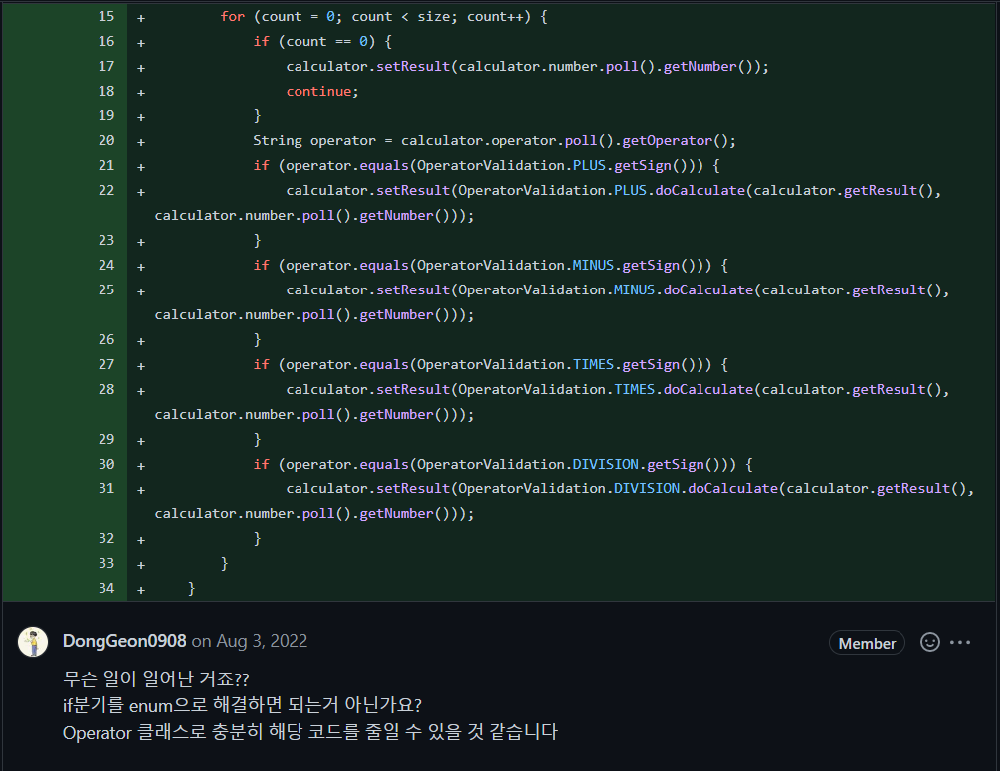
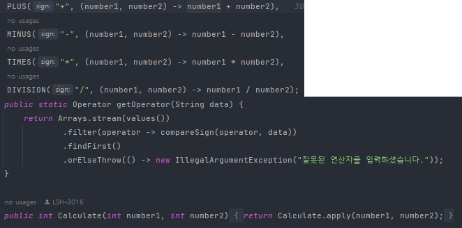
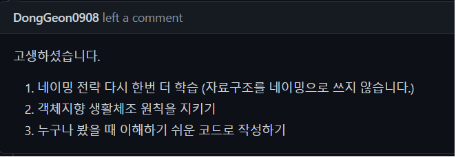
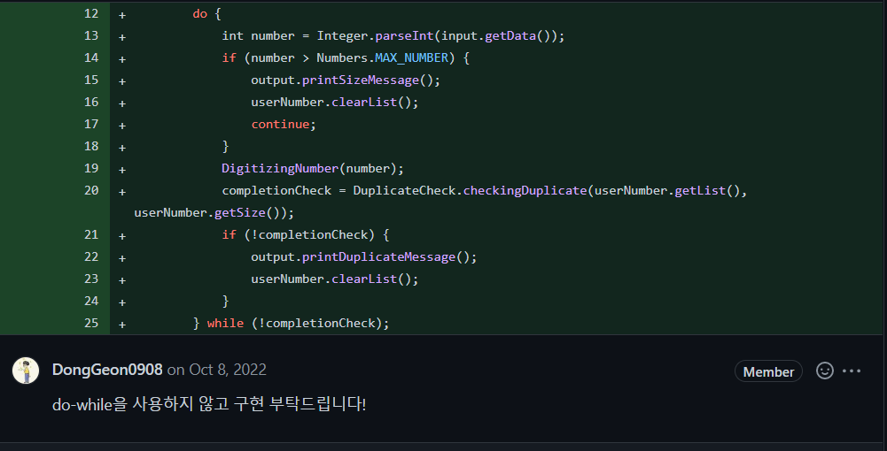
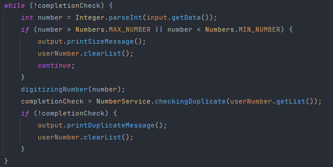
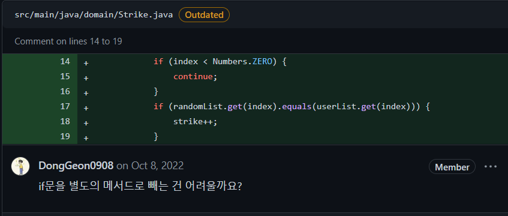
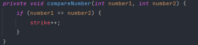
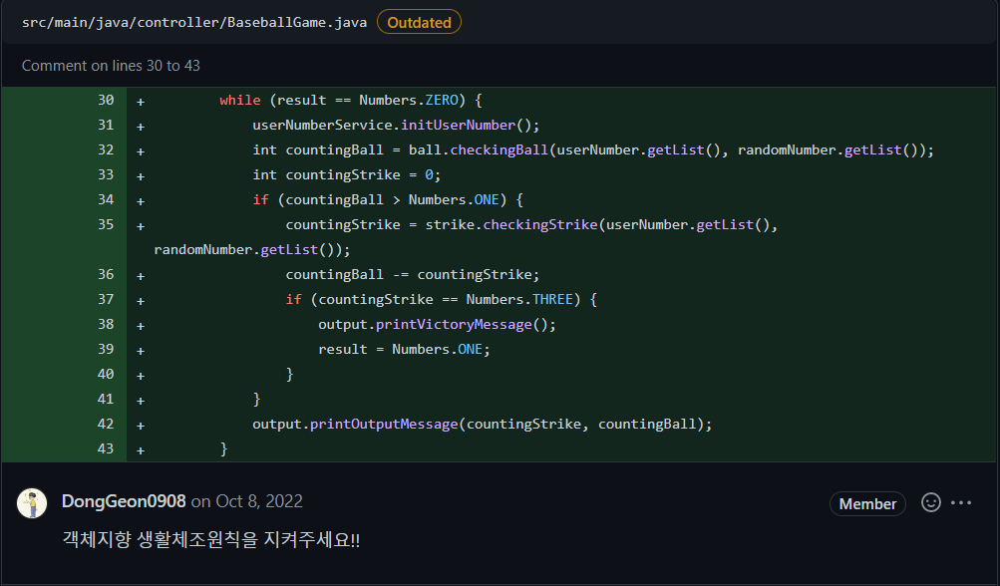
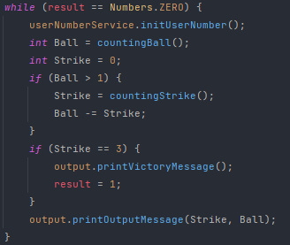

# Java Development
## todo-list 필수 요구사항
* ### TODLIST CRUD API
* ### RESTFUL한 API
* ### 클린코드 (냄새나지 않는 코드)
* ### 객체지향 패러다임

 

## REST (Representational State Transfer)
* ### 개념
  * #### 자원을 이름으로 구분하여 해당 자원의 상태(정보)를 주고 받는 모든 것
  * #### HTTP URI를 통해 자원을 명시하고, HTTP Method(POST, GET, PUT, DELETE)를 통해 해당 자원에 대한 CRUD Operation 적용
* ### 특징
  * ### Server-Client
    #### 자원 제공이 Server, 자원 요청이 Client
  * ### Stateless
    #### Server가 Client의 요청을 별개의 것들로 인식하고 처리
  * ### Cacheable
    #### HTTP 프로토콜의 캐싱 기능 적용
  * ### Layered System
    #### 다중 계층으로 구성하여 구조상의 유연성을 확보
  * ### Code-On-Demand
    #### Server로부터 스크립트를 받아 Client에서 실행
  * ### Uniform Interface
    #### URI로 지정한 Resource에 대한 조작을 통일되고 한정적인 인터페이스로 수행

## REST API
* ### 개념
  * #### REST 기반으로 서비스 API를 구현한 것
* ### REST API 설계 기본 규칙
  * ### 슬래시 구분자(/)는 계층 관계를 나타내는데 사용
    #### EX) http://localhost:8080/members/new
  * ### URI 마지막 문자는 슬래시(/)를 포함하지 않아야 함.
    #### EX) http://localhost:8080/members/new/ (X)
  * ### 하이픈(-)은 URI 가독성을 높이는데 사용
    #### 불가피하게 긴 URI경로를 사용하게 된다면 하이픈을 사용해 가독성을 높임
  * ### 밑줄(_)은 URI에 사용하지 않음
    #### 밑줄은 보기 어렵고, 문자를 가릴 가능성이 있으므로 사용하지 않음
  * ### URI경로에는 소문자가 적합
  * ### 파일확장자는 URI에 포함하지 않아야 함
  * ### 리소스 간에는 연관 관계가 있는 경우
    #### /리소스명/리소스 ID/관계가 있는 다른 리소스명으로 명시
* ### REST API 설계 예시
  

## 클린코드
* ### 중복 코드의 최소화
  
  

  
  
* ### 클린 코드의 조건들
  
* ### do-while 사용 X
  
  

  
  * ### 메소드의 분리
  
  

  
* ### 객체지향 생활체조
  
  

  

## 객체지향 패러다임
