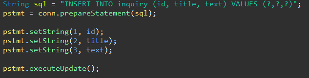

# Jpa Development

## DataBase와 Jpa

* ### 영속성과 DataBase
* ### JDBC
* ### ORM
* ### JPA와 Hibernate

 
 

## ■ 영속성과 DataBase

### 영속성(Persistence)

* #### 프로그램이 종료되어도 사라지지 않는 데이터의 특성
* #### 메모리상의 데이터를 데이터베이스를 활용하여 영속성을 부여
  #### ※ JDBC, JdbcTemplate, Jpa 등

### DataBase(DB)

#### 여러 사람이 공유하여 사용할 목적으로 체계화하여 통합, 관리하는 데이터의 집합

### DBMS

* #### DB를 관리하기 위한 프로그램
* #### MySQL, MariaDB, OracleDB 등이 있지만 가벼운 H2도 사용

### SQL

#### 관계형 데이터베이스 시스템(RDBMS)에서 자료를 관리 및 처리하기 위해 설계된 언어

 
 

## ■ JDBC (Java Database Connectivity)

### JDBC

#### 자바 프로그램이 데이터베이스와 연결되어 데이터를 주고받을 수 있게 해주는 API

* ### JDBC Driver
  #### db와 연결시키기 위한 중심 인터페이스
* ### Connection
  #### DB가 있는 URL과 user, password를 입력하여 db와 연결시키는 역할을 함
  
* ### Statement
  #### SQL Query문을 전송하는 역할을 함
* ### PreparedStatement
    * #### Statement의 하위 인터페이스
    * #### SQL문을 미리 컴파일 하여 실행속도를 높임
  
* ### ResultSet
  #### DB의 정보를 가져오기 위한 인터페이스
  

### 문제점

* #### 쿼리 실행 전 후로 객체 생성, 해제 등의 코드를 작성해야 함
* #### DB 로직을 작성함에 있어 예외처리를 작성해줘야 함
* #### SQL문을 일일히 작성해야 함

 
 

## ■ ORM (Object Relational Mapping)

### ORM

#### 객체와 데이터베이스의 관계를 매핑해주는 도구

### ORM과 객체지향

* #### 객체 간의 관계를 바탕으로 SQL을 자동으로 생성
* #### SQL문을 직접 작성하지 않고 엔티티를 객체로 표현
* #### 객체를 통해 간접적으로 데이터베이스 이용

### 장점

* #### 직관적인 코드(가독성) + 비즈니스 로직에 집중(생산성)
  #### SQL Query가 아닌 직접적인 코드(메서드)로 데이터 조작이 가능
* #### DBMS에 대한 종속성 저하
  #### 객체 간의 관계를 바탕으로 SQL을 자동생상허므로 RDBMS의 데이터구조와 객체 모델 사이의 간격을 좁힘

### 단점

* #### ORM으로만 서비스를 구현하기 어려움
  #### 설계에 매우 신중해야 하며, 프로젝트의 복잡성이 커질 경우 난이도 또한 올라감

 
 

## ■ JPA와 Hibernate

### JPA (Java Persistence API)

* #### 자바 어플리케이션에서 관계형 데이터베이스를 사용하는 방식을 정의한 인터페이스
* #### 구현체로는 Hibernate, EclipseLink, DataNucleus 등이 있음

### Hibernate

* #### JPA의 구현체 중 하나
* #### HQL(Hibernate Query Language)를 포함
    * #### 객체 지향의 강점을 누릴 수 있음(상속, 다형성, 관계 등)
    * #### 쿼리 결과로 객체를 반환

### 장점

* #### 객체지향적으로 데이터 관리 -> 비즈니스 로직에 집중
* #### 테이블 생성, 변경, 관리가 쉬움
* #### 불필요 코드를 줄일 수 있음

### ● Error

### Error executing DDL
#### 변수명을 잘못 설정하면 예약어 오류가 발생할 수 있음
### ● Solution

참고자료

* [HANAMON](https://hanamon.kr/orm%EC%9D%B4%EB%9E%80-nodejs-lib-sequelize-%EC%86%8C%EA%B0%9C/)
* [gmlwjd9405](https://gmlwjd9405.github.io/2019/02/01/orm.html)