# Spring Development
## Spring의 특징과 롬복
* ### Bean과 Component
* ### Spring Singleton
* ### Spring DI
* ### Lombok

 
 

## ■ Bean과 Component
#### 두 방식 모두 Spring 객체로 등록하기 위해 사용되는 어노테이션
### @Bean
* #### 개발자가 직접 작성하지 않은 외부 라이브러리를 등록하는데 사용
* #### 메소드에 붙여 사용 가능
  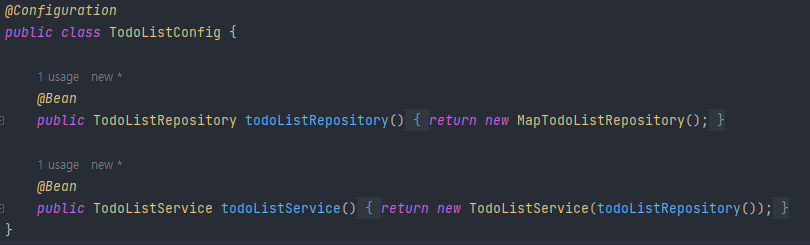
### @Component
* #### 개발자가 직접 수정이 가능한 클래스를 등록할 때 사용
* #### @ComponentScan을 통해 실행과 동시에 자동으로 Spring 객체로 등록 가능
* #### @Service, @Configuration, @Repository 등은 @Component를 상속
### ● TodoListConfig.class
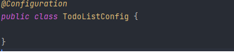
### ● TodoListRepository.class
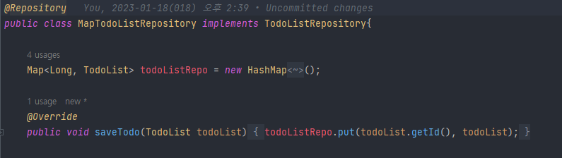
### ※ Component를 스캔할 수 있도록 설정해주거나 경로를 잘 설정해야함

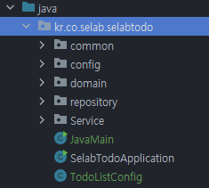

 
 

## ■ Spring Singleton
### Singleton pattern을 적용하지 않은 자바 객체
### ● Test Code
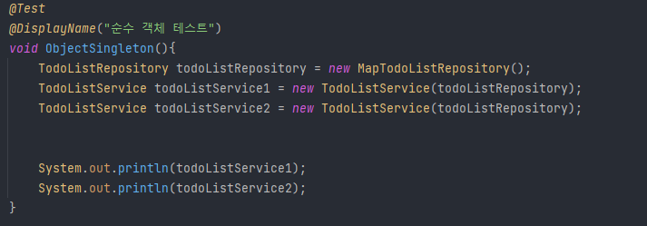
### ● Result
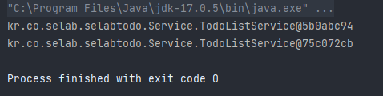
### `SingletonPattern` : 객체의 인스턴스가 오직 1개만 생성되는 패턴
  * ### Singleton pattern의 단점
    * #### 클라이언트가 구체 클래스에 의존 -> 결합도가 높아짐
    * #### 내부 설계 변경이 어려움
    * #### 상속이 불가능
    * #### 싱글톤 패턴을 위한 코드를 작성해야 해서 비효율적
### Spring Container(Singleton Container)
* #### 각 객체를 싱글톤으로 관리
* #### 싱글톤 패턴의 문제들을 모두 해결
### ● TodoListService.class

### ● Test Code
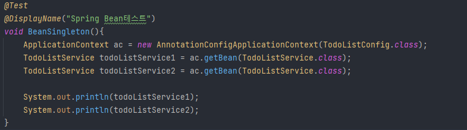
### ● Result
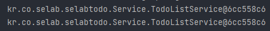

 
 

## ■ Spring DI
#### 객체간의 의존성을 없애기 위해, 의존관계를 외부에서 결정하고 주입하는 것
#### Spring에서 DI를 주입하는 방법은 3가지 있음
### Filed Injection
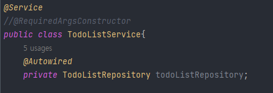
* #### 객체에 @Autowired를 붙여 DI를 하는 방법
* #### 코드가 간결하다는 큰 장점이 있음
* #### 순환참조로 인해 StackOverFlow가 발생할 수 있어 지양해야 하는 방법
### Setter Injection
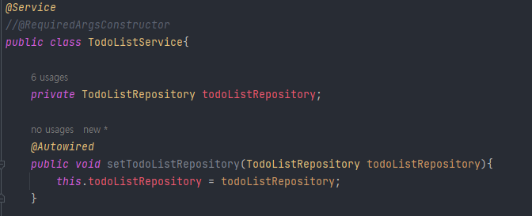
* #### setter를 생성하여 DI를 하는 방법
* #### 외부에서 변경이 가능할 수 있다는 단점이 있어 지양해야 하는 방법
### Constructor Injection
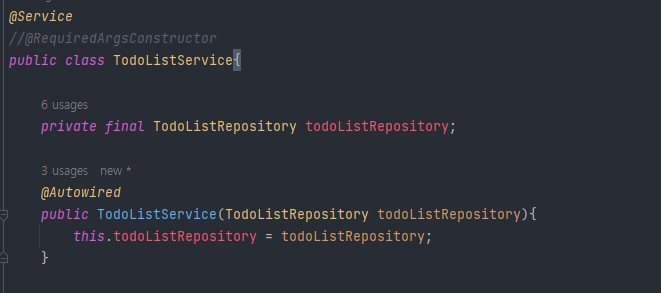
* #### 생성자를 이용하여 DI하는 방법
* #### 생성시에 DI를 하므로 NullpointerException을 방지할 수 있음
* #### final 선언이 가능하여 수정을 방지

 
 

## ■ Lombok
#### 반복 메서드 작성을 줄여주는 코드 다이어트 라이브러리
### 특징
* #### 어노테이션을 기반으로 코드 자동생성
* #### 반복코드의 다이어트로 가독성 및 유지보수 향상

참고자료
* [@치얼스헤나](https://cheershennah.tistory.com/183)